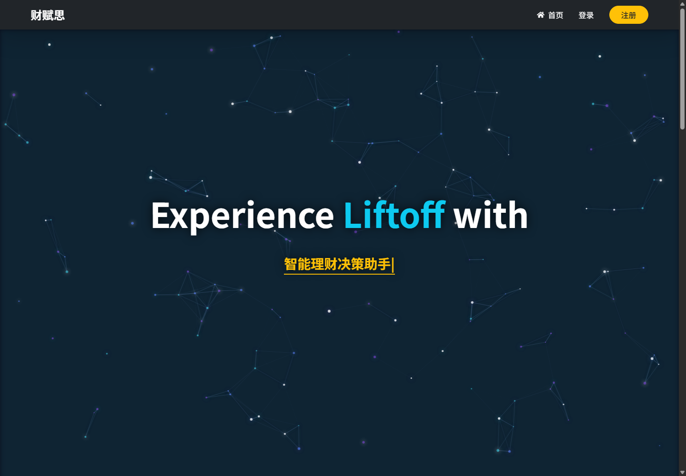
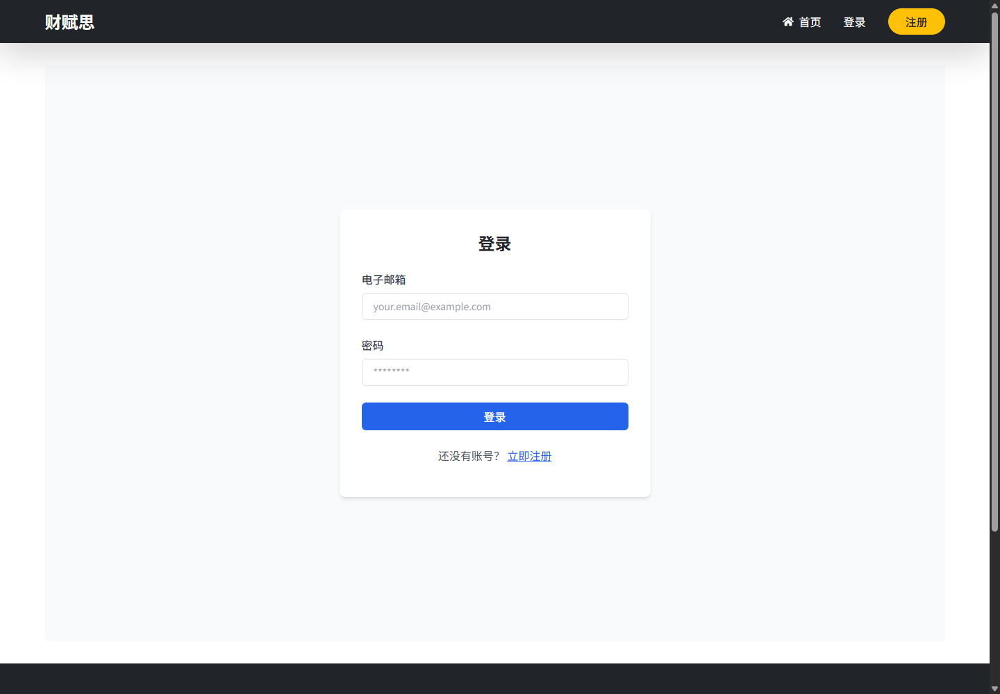
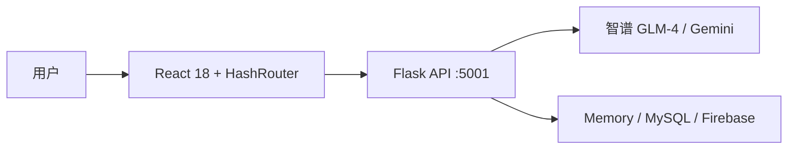

<p align="center">
  
</p>

<p align="center">
  <strong>你的 AI 金融心智教练</strong><br>
  把金融知识变成更清醒、更适合自己的行动选择。
</p>

<p align="center">
  <a href="#快速开始">快速开始</a> ·
  <a href="#产品一览">查看截图</a> ·
  <a href="#star-history">Star 趋势</a> ·
  <a href="https://github.com/XiaoCow666/Caifusi/issues">反馈问题</a>
</p>

<p align="center">
  <a href="https://github.com/XiaoCow666/Caifusi/stargazers"></a>
  <a href="https://github.com/XiaoCow666/Caifusi/network/members"></a>
  <a href="https://github.com/XiaoCow666/Caifusi/blob/main/LICENSE"></a>
  
  
</p>

> 项目定位：面向个人财务成长的实验性产品。当前仓库适合本地体验、功能验证和产品迭代；完整 AI 能力需要自行配置后端服务与密钥。

## 产品一览

先看真实页面，再决定是否运行项目：

<p align="center">
  
</p>

<p align="center">
  
</p>

<details>
<summary>查看登录页</summary>

<p align="center">
  
</p>
</details>

## 它解决什么问题

财务规划常常卡在三个地方：不知道自己处于什么状态、不知道下一步怎么做、知道了却很难坚持。Caifusi 把这条路径收进一个可持续迭代的产品闭环：

| 模块 | 用户得到的结果 |
| --- | --- |
| 金融心智评估 | 通过问卷梳理风险偏好、习惯与当前财务状态 |
| AI 金融心智教练 | 围绕个人情况进行对话式解释与行动建议 |
| Dashboard | 查看财务健康、预算、目标和进展 |
| 金融知识库 | 按主题搜索可读、可复习的基础知识 |

### 三步开始

1. 完成金融心智评估，先看见自己的起点。
2. 获取更贴合当前情况的计划与建议。
3. 在 Dashboard 和 AI 教练中持续复盘、调整和行动。

## 功能地图

- **公开内容**：首页、团队介绍、项目历程、金融知识库、FAQ、教程与使用说明。
- **个人工作区**：Dashboard、评估结果、目标与进展。
- **AI 交互**：通过 Flask API 连接智谱 GLM-4；Gemini 为可选集成。
- **开发体验**：React 18 + Flask，前后端分离，开发态默认使用内存数据和 localStorage mock auth。

## 快速开始

### 环境要求

- Node.js 18+
- Python 3.8+
- 若要使用 AI 教练：智谱 AI API Key（可选 Gemini Key）
- 若要接入真实账户/数据：Firebase 配置或其他后端存储配置

### 1. 配置后端环境变量

在仓库根目录创建 `.env`，不要把真实密钥提交到 Git：

```powershell
Copy-Item .env.example .env
```

至少填写 `ZHIPUAI_API_KEY` 和 `SECRET_KEY`；`GEMINI_API_KEY` 可选。前端如需使用 Firebase，再按 `src/firebase.js` 的变量名创建 `.env.local`。

### 2. 安装依赖并启动

```powershell
# 终端 A：后端 API（http://localhost:5001）
python -m pip install -r backend/requirements.txt
python backend/run_dev_enhanced.py

# 终端 B：React 前端（http://localhost:3000）
npm install
npm start
```

Windows 也可以直接运行 [`快速启动.cmd`](快速启动.cmd)。这个一键脚本读取 `.env.local`；如果使用它，请先准备该文件。启动后打开 <http://localhost:3000>。

### 3. 连接远程后端

本地开发默认代理到 `http://localhost:5001`。如果部署到 GitHub Pages 或其他静态托管平台，请在构建环境设置 `REACT_APP_API_URL`，并让后端 CORS 允许前端域名；否则首页等静态页面可以展示，AI 教练无法连通。

## 部署路线

| 目标 | 推荐方式 | 关键点 |
| --- | --- | --- |
| 只展示前端 | GitHub Pages `/docs` | 构建时使用 `PUBLIC_URL=.`，发布 `build/` 内容；不包含后端能力 |
| 完整产品体验 | 静态前端 + 独立 Flask API | API 使用 HTTPS，配置 `REACT_APP_API_URL` 和 `CORS_ALLOWED_ORIGINS` |
| 单机试点 | Nginx + Gunicorn + MySQL/Firebase | 后端只绑定本机端口，生产环境关闭开发服务器和默认密钥 |

完整的 Pages、Gunicorn、Systemd、Nginx、HTTPS、数据库和故障排查步骤见 [`DEPLOYMENT_GUIDE.md`](DEPLOYMENT_GUIDE.md)。

## 技术结构



| 层 | 当前实现 |
| --- | --- |
| Web | React 18、React Router、Bootstrap、Tailwind、React Icons |
| API | Flask、Flask-CORS、python-dotenv |
| AI | 智谱 AI GLM-4；Gemini 可选 |
| 数据 | 开发态内存数据；可配置 MySQL / Firebase |

## 使用边界与安全

- 当前 `AuthContext` 是开发态 mock auth，适合演示和本地开发，不应直接视为生产级账户系统。
- 不要在 README、截图、Issue 或提交记录中暴露 API Key、Firebase 私钥或数据库凭据。
- GitHub Pages 只承载前端静态资源；完整 AI 体验需要一个可访问且正确配置 CORS 的后端。
- Caifusi 用于金融教育与决策复盘，不构成投资、税务、法律或其他专业意见；重要决定请咨询持牌专业人士。
- 详细密钥配置见 [`SECURITY_SETUP.md`](SECURITY_SETUP.md)，部署说明见 [`DEPLOYMENT_GUIDE.md`](DEPLOYMENT_GUIDE.md)。

## 文档入口

| 需求 | 文档 |
| --- | --- |
| 第一次使用 | [`使用说明.md`](使用说明.md) |
| 部署前端/后端 | [`DEPLOYMENT_GUIDE.md`](DEPLOYMENT_GUIDE.md) |
| 配置密钥 | [`SECURITY_SETUP.md`](SECURITY_SETUP.md) |
| 启动异常排查 | [`启动问题排查.md`](启动问题排查.md) |
| 智谱 API 配置 | [`docs/智谱API密钥获取与配置指南.md`](docs/智谱API密钥获取与配置指南.md) |

## Star History

徽章显示当前状态，下面的图表展示随时间变化的关注度趋势：

<p align="center">
  <a href="https://star-history.com/#XiaoCow666/Caifusi&Date">
    
  </a>
</p>

## 参与项目

欢迎通过 [Issues](https://github.com/XiaoCow666/Caifusi/issues) 提交体验反馈、产品想法和可复现的问题；提交代码前请说明变更动机、验证方式以及是否涉及密钥或数据结构。

## License

本项目采用 [MIT License](LICENSE)。
