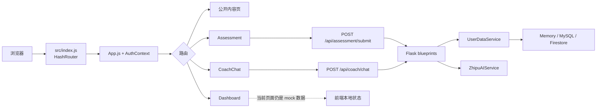

<<<<<<< HEAD
# Caifusi 财赋思 — 项目理解文档

> 本文档基于公开仓库代码和实际运行验证整理，用于项目定位、模块结构、核心流程、运行结果、风险疑问和改进方向的梳理。

---

## 文档元信息

| 项 | 内容 |
|---|---|
| AI 工具 | 豆包（Doubao）— 用于代码阅读、结构梳理、运行验证和文档撰写 |
| 阅读范围 | `README.md`、`package.json`、`backend/app/__init__.py`、`backend/app/routes/coach_routes.py`、`backend/app/services/zhipuai_service.py`、`backend/requirements.txt`、`src/App.js`、`src/services/api.js`、`src/contexts/AuthContext.js`、项目目录结构 |
| 验证环境 | Ubuntu 22.04 / Python 3.12.11（主验证环境）；另在 Windows 10 / Python 3.14 上做过依赖兼容性验证 |
| 验证时间 | 2026-09-07（初版）；2026-09-08（第四轮审查修复） |
| 事实与推断边界 | **事实**：来自代码阅读和实际运行输出的内容；**推断**：基于代码结构推测的设计意图和潜在问题，已在文中标注。本文不包含任何 API 密钥、数据库凭据或用户隐私数据。 |

### 第四轮审查修复记录

| 编号 | 严重级别 | 问题 | 修复位置 |
|---|---|---|---|
| P2-1 | 中 | 场景 E 中 `INSTALL_EXIT_CODE=$?` 实际取自管道末尾的 `tee`，pip 失败时可能误判为成功 | §6 场景 E 步骤 2 |
| P2-2 | 中 | 场景 E 中步骤 3b 的日志提取与 `exit 1` 位于 `if` 分支外，导致成功路径误报故障并退出、失败路径跳过日志提取；后端前台运行阻塞取证 | §6 场景 E 步骤 3、3a、3b |

---

## 1. 项目定位

### 1.1 一句话定位

**Caifusi（财赋思）是一个面向个人财务学习与复盘的 AI 辅助 Web 应用。**

### 1.2 核心价值

通过问卷评估、AI 对话、数据看板和知识库四大模块，帮助用户：
- 了解自身风险偏好、消费习惯和财务状态
- 学习基础金融知识
- 通过 AI 教练讨论财务问题并整理行动方案
- 在 Dashboard 中追踪预算、目标和进展

### 1.3 使用边界

- 用于**金融教育和个人决策复盘**，不替代投资、税务或法律专业意见
- 当前版本 `v0.1.0`，适合本地体验、功能验证和产品迭代
- AI 教练功能需要单独配置后端服务和智谱 AI API 密钥

### 1.4 技术栈

| 层 | 技术 | 版本 |
|---|---|---|
| 前端 | React + React Router + Bootstrap + Tailwind | React 18 |
| 后端 | Flask + Flask-CORS + python-dotenv | Flask 3.x |
| AI | 智谱 AI GLM-4（主）、Google Gemini（可选） | zhipuai 2.1.5 |
| 数据 | 开发态内存 / 可配置 MySQL 或 Firebase | — |
| 部署 | GitHub Pages（静态前端）/ Flask API / Nginx+Gunicorn | — |

---

## 2. 目录与模块

### 2.1 顶层目录结构

```
Caifusi/
├── backend/                    # Flask 后端
│   ├── app/
│   │   ├── __init__.py        # 应用工厂，路由注册，CORS 配置
│   │   ├── config.py          # 配置类（DB_TYPE、密钥等）
│   │   ├── routes/            # 路由蓝图
│   │   │   ├── coach_routes.py       # AI 教练对话接口
│   │   │   ├── dashboard_routes.py   # 数据看板接口
│   │   │   ├── assessment_routes.py  # 财务评估接口
│   │   │   └── auth_routes.py        # 认证接口
│   │   ├── services/          # 业务服务
│   │   │   ├── zhipuai_service.py    # 智谱 AI 封装
│   │   │   ├── auth_service.py       # 认证服务
│   │   │   ├── coach_service.py      # 教练业务逻辑
│   │   │   ├── user_data_service.py  # 用户数据服务
│   │   │   ├── firestore_service.py  # Firebase 存储
│   │   │   └── ...
│   │   └── utils/
│   │       └── db_mysql.py    # MySQL 辅助类
│   ├── services/              # ⚠️ 重复的服务目录（备用导入路径）
│   ├── routes/                # ⚠️ 重复的路由目录
│   ├── run_dev_enhanced.py    # 主启动入口（开发模式增强版）
│   ├── run_dev.py             # 开发模式入口
│   ├── run_dev_fixed.py       # 修复版入口
│   ├── run.py                 # 生产入口
│   ├── requirements.txt       # Python 依赖（版本范围）
│   ├── requirements-fixed.txt  # Python 依赖（固定版本，较旧）
│   └── schema.sql             # 数据库表结构
├── src/                        # React 前端
│   ├── App.js                 # 路由配置、受保护路由、API 状态指示
│   ├── index.js               # 应用入口
│   ├── pages/                 # 页面组件
│   │   ├── Home.js            # 首页（落地页）
│   │   ├── Login.js           # 登录页
│   │   ├── Register.js        # 注册页
│   │   ├── Dashboard.js       # 数据看板
│   │   ├── Assessment.js      # 财务评估问卷
│   │   ├── CoachChat.js       # AI 教练对话
│   │   ├── NotFound.js        # 404 页
│   │   └── info/              # 信息页（团队、联系、知识库、FAQ等）
│   ├── components/            # 通用组件（Layout、导航、粒子背景等）
│   ├── contexts/
│   │   └── AuthContext.js     # 认证上下文（⚠️ 当前为 mock auth）
│   ├── services/
│   │   ├── api.js             # API 服务封装（axios + fetch）
│   │   └── firebase.js        # Firebase 初始化
│   ├── firebase.js            # Firebase 配置（重复）
│   └── setupProxy.js          # 开发代理配置（→ localhost:5001）
├── docs/                       # 项目文档
├── assets/                     # 品牌资源和预览图
├── public/                     # 静态资源
├── .env.example               # 环境变量模板
├── package.json               # 前端依赖和脚本
├── DEPLOYMENT_GUIDE.md        # 部署指南
├── SECURITY_SETUP.md          # 安全配置指南
└── README.md                  # 项目说明
```

### 2.2 后端模块说明

| 模块 | 文件 | 职责 | 关键接口 |
|---|---|---|---|
| 应用工厂 | `backend/app/__init__.py` | 创建 Flask 应用、配置 CORS、注册所有路由蓝图、健康检查 | `create_app()` |
| AI 教练 | `backend/app/routes/coach_routes.py` | 接收对话请求，调用智谱 AI 服务，返回回复 | `POST /api/coach/chat`、`GET /api/coach/health` |
| 数据看板 | `backend/app/routes/dashboard_routes.py` | 财务概览、健康度、目标管理、统计、建议 | `GET/POST/PUT/DELETE /api/dashboard/*` |
| 财务评估 | `backend/app/routes/assessment_routes.py` | 提交评估、获取结果、历史记录、最新评估 | `POST /api/assessment/submit`、`GET /api/assessment/*` |
| 智谱 AI 服务 | `backend/app/services/zhipuai_service.py` | 封装智谱 AI SDK，构建 prompt，调用 GLM-4，解析响应 | `ZhipuAIService.get_chat_response(data)` |

### 2.3 前端模块说明

| 模块 | 文件 | 职责 |
|---|---|---|
| 路由配置 | `src/App.js` | HashRouter 路由表、受保护路由（`ProtectedRoute`）、API 连接状态指示 |
| API 服务 | `src/services/api.js` | axios 实例、请求/响应拦截器、AI 教练对话、Dashboard、Assessment 等 API 封装 |
| 认证上下文 | `src/contexts/AuthContext.js` | 用户登录状态管理（⚠️ 当前为 mock 实现，数据存 localStorage） |
| AI 教练页 | `src/pages/CoachChat.js` | 对话界面、消息列表、输入框、调用 `sendMessageToCoach()` |
| 数据看板页 | `src/pages/Dashboard.js` | 财务健康度、预算、目标列表、进度展示 |
| 评估问卷页 | `src/pages/Assessment.js` | 多步问卷、提交评估、查看结果 |

---

## 3. 核心流程

### 3.1 AI 教练对话流程（已验证）

```
用户输入消息
    ↓
CoachChat.js 组件收集 { message, user_id, chat_history, assessment_result }
    ↓
调用 sendMessageToCoach(data) [src/services/api.js]
    ↓
POST http://localhost:5001/api/coach/chat（前端直接请求后端绝对地址）
    ↓
coach_routes.py → chat() 处理请求
    ↓
参数校验（message 必填）
    ↓
zhipuai_service.get_chat_response(data)
    ↓
构建系统 prompt（金融教练角色设定）+ 用户消息 + 历史上下文
    ↓
调用智谱 AI SDK → GLM-4 模型
    ↓
解析响应，提取 reply 文本
    ↓
返回 JSON { status: "success", reply: "..." }
    ↓
前端渲染 Markdown 格式的 AI 回复
```

**关键事实**：
- 后端启动日志显示 `✓ 使用智谱AI GLM-4模型`
- 实际对话测试中，AI 返回了包含 10 条理财策略、投资组合分配表格和风险提示的详细回复
- 响应时间约 3-8 秒（取决于网络和 API 负载）
- ⚠️ `src/setupProxy.js` 虽配置了 `/api` → `http://localhost:5001` 的开发代理，但 `api.js` 中实际使用绝对地址 `http://localhost:5001` 直接请求后端，**请求不经过前端开发服务器代理**；CORS 由后端 Flask-CORS 处理

### 3.2 用户认证流程（推断）

> ⚠️ 以下为基于代码结构的推断，`AuthContext.js` 为 mock 实现。

```
用户注册/登录
    ↓
AuthContext 处理（当前为本地 mock，不调用后端真实认证接口）
    ↓
用户信息和 token 存入 localStorage
    ↓
ProtectedRoute 检查 currentUser，未登录则重定向 /login
    ↓
API 请求拦截器自动添加 Authorization: Bearer <token>
```

**关键事实**：
- README 明确说明「`AuthContext` 使用 mock auth」
- `api.js` 中定义了 `registerUser()` 和 `loginUser()`，但实际是否调用后端 `auth_routes.py` 需进一步验证
- 受保护路由：`/dashboard`、`/assessment`、`/coach`

### 3.3 财务评估流程（推断）

```
用户在 Assessment 页填写多步问卷
    ↓
调用 submitAssessmentNew(assessmentData)
    ↓
POST /api/assessment/submit
    ↓
assessment_routes.py 处理，计算评估结果
    ↓
结果存入内存/MySQL（取决于 DB_TYPE 配置）
    ↓
前端可通过 /api/assessment/latest 和 /api/assessment/history 查询
```

### 3.4 Dashboard 数据流程（推断）

```
用户进入 Dashboard 页
    ↓
并行调用多个 API：
  - GET /api/dashboard/overview
  - GET /api/dashboard/financial-health
  - GET /api/dashboard/goals
  - GET /api/dashboard/recommendations
    ↓
dashboard_routes.py 返回数据（开发态为内存中的 mock 数据）
    ↓
前端渲染图表、进度条、目标列表
```

---

## 4. 运行 / 测试结果

### 4.1 环境要求与实际验证

| 项 | 文档要求 | 实际验证环境 | 结果 |
|---|---|---|---|
| Node.js | ≥ 18 | 20.x（Windows） | ✅ 通过 |
| Python | ≥ 3.8 | 3.12.11（Ubuntu，主验证）/ 3.14（Windows，依赖兼容验证） | ✅ 3.12 手动安装核心依赖成功；⚠️ 3.14 上完整 `pip install -r requirements.txt` 出现 `resolution-too-deep`（现象观察，根因待确认，见 §5.1.1） |
| 智谱 AI API Key | 必填 | 已配置（.env，未提交） | ✅ 正常调用，ZhipuAIService 初始化成功 |
| Gemini API Key | 可选 | 未配置 | ✅ 不影响主功能 |

### 4.2 启动命令与结果

#### 后端启动

**命令：**
```bash
python backend/run_dev_enhanced.py
```

**关键输出（事实）：**
```
=== 财赋思后端服务启动 (增强版) ===
✓ 系统路径设置成功
✓ 成功加载 .env 文件
✓ 环境变量设置完成
✓ 应用模块导入成功
配置CORS...
CORS 配置完成，允许的来源: ['http://localhost:3000', 'http://127.0.0.1:3000', 'https://xiaocow666.github.io']
✓ 成功注册真实的AI教练服务
✓ 成功注册Dashboard服务
✓ 成功注册Assessment服务
✓ 应用实例创建成功
✓ 开发模式已启用
✓ 使用智谱AI GLM-4模型
✓ API地址: http://localhost:5001
✓ AI模型初始化完成!
* Running on http://127.0.0.1:5001
```

**已注册路由（事实）：**
- `POST /api/coach/chat`
- `GET /api/coach/health`
- `GET /api/dashboard/overview`
- `GET /api/dashboard/financial-health`
- `GET/POST /api/dashboard/goals`
- `PUT/DELETE /api/dashboard/goals/<goal_id>`
- `GET /api/dashboard/statistics`
- `GET /api/dashboard/recommendations`
- `POST /api/assessment/submit`
- `GET /api/assessment/results`
- `GET /api/assessment/history`
- `GET /api/assessment/latest`
- `GET /api/health`

#### 前端启动

**命令：**
```bash
npm install
npm start
```

**关键输出（事实）：**
```
added 1731 packages in 35s
Compiled successfully!
```

- 前端地址：`http://localhost:3000`
- 浏览器自动打开，页面正常渲染（深色科技感主题 + 粒子网络动画背景）

### 4.3 功能验证结果

| 功能 | 验证方式 | 结果 |
|---|---|---|
| 首页渲染 | 浏览器访问 http://localhost:3000 | ✅ 正常显示财赋思落地页 |
| 注册/登录 | 点击注册按钮，填写信息 | ✅ 可注册并登录（mock auth） |
| AI 教练对话 | 登录后进入 /coach，发送消息 | ✅ 智谱 AI GLM-4 返回详细理财建议 |
| Dashboard 访问 | 登录后进入 /dashboard | ✅ 页面可访问（数据为开发态 mock） |
| 评估问卷 | 登录后进入 /assessment | ✅ 问卷页面可访问 |
| 后端健康检查 | `GET http://localhost:5001/api/health` | ✅ 返回 `{status: "healthy"}` |

#### Ubuntu 22.04 / Python 3.12.11 环境 API 实测（2026-09-07）

> ⚠️ **验证方式说明**：以下实测为**手动选择性安装核心依赖**后的运行结果，**不是**执行原始 `pip install -r backend/requirements.txt` 全量安装的结果。该实测验证了「核心依赖子集可运行」，但**不能证明原始安装流程已修复**，也不能替代 §6 中要求的干净环境全量验证。

**依赖安装方式（手动选择，非原始 requirements.txt — 不可复现）：** 当时手动选择性安装了部分核心依赖（包括 flask、flask-cors、zhipuai、sniffio、PyMySQL 等，列表不完整），跳过了 firebase-admin / gunicorn / google-generativeai，安装过程无报错。

> ⚠️ **可复现性声明**：该次手动安装的**精确命令、pip 版本、各包最终版本号均未留存记录**，且依赖列表使用"等"省略了实际安装的完整集合。因此以下 API 实测结果**仅为历史观察记录，不构成可复现的验证证据**，也无法据此判断 sniffio 缺失是来自原始依赖声明还是手动安装过程。如需可复现验证，请按 §6「验证方式」中的场景 A 在干净环境中重新执行。

**后端启动关键日志：**
```
✓ 成功加载 .env 文件
ZhipuAIService初始化成功，API密钥长度: 49
✓ 成功注册真实的AI教练服务
✓ 成功注册Dashboard服务
✓ 成功注册Assessment服务
✓ 使用智谱AI GLM-4模型
✓ AI模型初始化完成!
* Running on http://127.0.0.1:5001
```
> 注：启动时有 `firebase_admin could not be imported` 警告，属预期行为（未安装可选依赖），不影响核心功能。

**curl 实测结果：**
```bash
# 健康检查
$ curl -s http://localhost:5001/api/health
{"message":"API服务正常运行中","status":"healthy"}

# AI教练健康检查
$ curl -s http://localhost:5001/api/coach/health
{"message":"AI教练服务运行正常","status":"ok"}

# AI教练对话（复利概念）
$ curl -s -X POST http://localhost:5001/api/coach/chat \
  -H "Content-Type: application/json" \
  -d '{"message":"用一句话说明什么是复利","user_id":"test_verify"}'
{"reply":"复利是指利息在计算时不仅包括本金产生的利息，还包括之前利息产生的利息，从而实现资金增值的加速效应。","status":"success"}
```

### 4.4 AI 教练实际响应示例（事实）

向 AI 教练发送理财规划请求后，返回内容包含：
1. 10 条理财策略（应急储备、预算管理、债务管理、投资分散、长期投资、定期复盘、保险保障、持续学习、避免冲动决策、咨询专业人士）
2. 投资组合分配示例表格（股票 50%、债券 30%、房地产 10%、其他 10%）
3. 风险提示（所有投资存在风险，包括本金损失可能性）

---

## 5. 风险与疑问

### 5.1 已确认风险（事实）

| # | 风险 | 严重程度 | 说明 | 证据 |
|---|---|---|---|---|
| R3 | **认证为 mock 实现** | 高 | `AuthContext.js` 使用本地 mock auth，用户数据存 localStorage，无真实后端认证，不可用于生产 | README 明确说明 |
| R4 | **数据持久化缺失** | 中 | 开发态数据主要在内存中，服务重启后数据丢失；MySQL/Firebase 需额外配置 | README 和代码结构 |
| R5 | **重复代码目录** | 低 | `backend/app/services/` 和 `backend/services/`、`backend/app/routes/` 和 `backend/routes/` 并存，代码维护混乱 | 目录结构观察 |
| R6 | **多个启动脚本并存** | 低 | `run.py`、`run_dev.py`、`run_dev_enhanced.py`、`run_dev_fixed.py` 四个启动入口，职责不清晰 | 目录结构观察 |
| R7 | **前端 API 地址硬编码占位符** | 低 | `src/services/api.js` 中 GitHub Pages 环境的 API 地址硬编码为 `'https://你的API服务器地址'` | 代码阅读 |
| R8 | **gunicorn 不支持 Windows 运行** | 低 | `requirements.txt` 包含 `gunicorn`，而 gunicorn 官方仅支持 Unix 类系统运行；**但"放入默认依赖会导致 Windows 上 pip install 失败"尚未有直接报错证据**，当前观察到的 Windows 安装故障为 `resolution-too-deep`，未指向 gunicorn | 运行限制：gunicorn 官方文档 + requirements.txt；安装失败：待验证 |

### 5.1.1 观察到的依赖故障现象（根因待确认）

> ⚠️ 以下为实际运行中观察到的报错现象，**根因尚未经隔离实验确认**。当前归因仅为基于现象的推测，不作为已证实结论。

| # | 观察到的现象 | 推测归因（待确认） | 验证环境与命令 | 缺失的验证 |
|---|---|---|---|---|
| R1 | 完整执行 `pip install -r backend/requirements.txt` 时出现 `error: resolution-too-deep`，pip 依赖解析失败 | 推测与 `firebase-admin>=6.5.0` 在 Python 3.14 上的依赖图有关，但**未通过单独安装 firebase-admin 复现**，不能排除其他依赖组合触发 | Windows 10 / Python 3.14 / pip 版本待补充；命令：`pip install -r backend/requirements.txt`；完整错误日志待补充 | 需在干净环境中单独安装 firebase-admin 验证是否复现；需确认 pip 版本及 `--resolution` 参数；需对比 Python 3.12 下完整安装是否成功 |
| R2 | 后端首次启动时出现 `ModuleNotFoundError: No module named 'sniffio'`，AI 服务初始化受影响 | 推测 `zhipuai` SDK 依赖 `sniffio` 但 `requirements.txt` 未显式声明；但**同一文档后文又称 SDK 已隐式安装 sniffio**，两种描述未区分，需确认报错发生时的依赖安装方式 | 报错环境与精确安装命令待补充；后端启动日志完整片段待补充 | 需确认报错时是否执行了完整 `pip install -r requirements.txt`；需验证 `pip show zhipuai` 的依赖列表是否包含 sniffio；需区分「全新安装后首次启动」与「手动补装部分依赖后启动」两种场景 |

### 5.2 待确认疑问（推断）

| # | 疑问 | 说明 | 需要进一步验证 |
|---|---|---|---|
| Q1 | 前端注册/登录是否真的调用后端 `auth_routes.py`？ | `api.js` 定义了 `registerUser()` 和 `loginUser()`，但 `AuthContext.js` 为 mock，需确认实际调用链 | 阅读 `AuthContext.js` 和 `Login.js` 完整代码 |
| Q2 | Dashboard 数据是真实计算还是纯 mock？ | `dashboard_routes.py` 返回的数据来源需确认 | 阅读 `dashboard_routes.py` 完整代码 |
| Q3 | 评估结果的计算逻辑是什么？ | `assessment_routes.py` 中评估算法需确认 | 阅读 `assessment_routes.py` 完整代码 |
| Q4 | MySQL 模式是否可直接使用？ | `schema.sql` 和 `db_mysql.py` 存在，但需确认完整性 | 阅读 `schema.sql` 和 `config.py` |
| Q5 | Firebase 集成的完整度如何？ | 前端和后端都有 Firebase 相关代码，但实际功能覆盖需确认 | 阅读 `firebase.js` 和 `firestore_service.py` |

---

## 6. 改进方向：后端依赖声明拆分（方案待验证）

### 改进项：拆分可选依赖，显式声明 sniffio，提升环境兼容性

**优先级：高 | 预估工作量：0.5-1 天 | 风险：待评估（原文档标注为"极低"，但尚未在干净环境完成全量验证，以下保证在验证完成前不成立）**

#### 问题描述

当前 `backend/requirements.txt` 存在以下待处理项：

1. **观察到的现象（根因待确认）**：在 Windows 10 / Python 3.14 上完整执行 `pip install -r backend/requirements.txt` 出现 `error: resolution-too-deep`。推测可能与 `firebase-admin>=6.5.0` 的依赖图有关，但未通过单独安装复现，不能排除其他依赖组合触发。
2. **观察到的现象（根因待确认）**：后端首次启动时出现 `ModuleNotFoundError: No module named 'sniffio'`。推测 `zhipuai` SDK 依赖 `sniffio` 但顶层 `requirements.txt` 未显式声明；但同一环境下 `zhipuai` 安装时是否已隐式拉取 `sniffio` 尚未验证，两种可能性未区分。
3. **已确认的设计问题（运行限制）**：`gunicorn` 官方仅支持 Unix 类系统运行，放入默认 `requirements.txt` 意味着 Windows 用户即使安装成功也无法在本地运行 gunicorn；**但"放入默认依赖会导致 Windows 上 pip install 直接失败"尚未有独立报错证据**，当前观察到的 Windows 安装故障为 `resolution-too-deep`，未指向 gunicorn。此外，`firebase-admin` 和 `google-generativeai` 属于可选功能依赖，不应阻塞核心功能安装。

#### 改进方案

**第一步：修改 `backend/requirements.txt`（核心依赖）**

将可选依赖从默认安装中移除，显式添加 `sniffio`：

```diff
  # Flask 框架及扩展
  flask>=3.0.0
  flask-cors>=4.0.0

  # 环境变量管理
  python-dotenv>=1.0.0

- # Firebase Admin SDK
- firebase-admin>=6.5.0
+ # Firebase Admin SDK → 见 requirements-firebase.txt（可选）

  # Google Generative AI (如果使用 Gemini)
- google-generativeai>=0.3.1
+ # Google Generative AI → 见 requirements-gemini.txt（可选）

  # HTTP 请求库
  requests>=2.31.0

- # WSGI 服务器
- gunicorn>=21.2.0
+ # WSGI 服务器 → 见 requirements-prod.txt（Unix 生产环境可选）

  # 智谱 AI SDK
  zhipuai>=2.1.5
+ # zhipuai SDK 运行时依赖（显式声明，避免隐式依赖缺失）
+ sniffio>=1.3.0

  # MySQL 数据库驱动及加密支持
  PyMySQL>=1.1.0
  cryptography>=41.0.0
```

**第二步：按功能拆分可选依赖文件（不再合并为单一 optional 文件）**

新增 `backend/requirements-firebase.txt`：
```txt
# 可选依赖 — Firebase 存储功能
# 仅当 DB_TYPE=firebase 或使用 firestore_service.py 时安装
firebase-admin>=6.5.0
```

新增 `backend/requirements-gemini.txt`：
```txt
# 可选依赖 — Google Gemini AI 模型
# 仅当配置 GEMINI_API_KEY 并使用 Gemini 时安装
google-generativeai>=0.3.1
```

新增 `backend/requirements-prod.txt`：
```txt
# 可选依赖 — Unix 生产环境 WSGI 服务器
# 仅在 Linux/macOS 生产部署时安装；Windows 不支持
gunicorn>=21.2.0
```

**第三步：各环境安装命令矩阵**

| 环境 | 用途 | 安装命令 |
|---|---|---|
| 本地开发（Windows/macOS/Linux） | 核心功能 + 智谱 AI | `pip install -r backend/requirements.txt` |
| 使用 Firebase 存储 | 核心 + Firebase | `pip install -r backend/requirements.txt -r backend/requirements-firebase.txt` |
| 使用 Gemini 模型 | 核心 + Gemini | `pip install -r backend/requirements.txt -r backend/requirements-gemini.txt` |
| 生产部署（Linux） | 核心 + WSGI 服务器 | `pip install -r backend/requirements.txt -r backend/requirements-prod.txt` |
| 生产部署 + Firebase（Linux） | 全量 | `pip install -r backend/requirements.txt -r backend/requirements-firebase.txt -r backend/requirements-prod.txt` |

> ⚠️ 注意：Windows 用户即使需要 Firebase，也只安装 `requirements-firebase.txt`，不会引入 `gunicorn`（因为 gunicorn 已独立到 `requirements-prod.txt`）。

**第四步：需要同步修改的部署入口与文档位置**

依赖拆分后，以下文件中引用 `requirements.txt` 或 `gunicorn` 的位置必须同步更新，否则生产部署会缺少 gunicorn：

| 文件 | 行号/位置 | 当前内容 | 需要修改为 |
|---|---|---|---|
| `README.md` | 第 95 行 | `pip install -r backend/requirements.txt` | 补充说明：核心依赖安装命令；生产环境需追加 `-r backend/requirements-prod.txt` |
| `DEPLOYMENT_GUIDE.md` | 第 37 行（Windows） | `pip install -r backend\requirements.txt` | 保持核心安装命令，补充可选依赖说明 |
| `DEPLOYMENT_GUIDE.md` | 第 46 行（Linux） | `pip install -r backend/requirements.txt` | 生产部署应改为 `pip install -r backend/requirements.txt -r backend/requirements-prod.txt` |
| `DEPLOYMENT_GUIDE.md` | 第 184-185 行 | `pip install --upgrade pip` + `pip install -r backend/requirements.txt` | 生产环境追加 prod 依赖 |
| `DEPLOYMENT_GUIDE.md` | 第 223 行 | `.venv/bin/gunicorn ...` | gunicorn 调用保持不变，但需确认 prod 依赖已安装 |
| `DEPLOYMENT_GUIDE.md` | 第 248 行（systemd） | `ExecStart=.../gunicorn ...` | 同上，systemd 服务定义保持不变 |
| `DEPLOYMENT_GUIDE.md` | 第 312 行 | `pip install -r backend/requirements.txt` | 根据部署场景追加对应可选依赖 |

#### 风险评估（待验证，原"低风险"保证暂撤回）

> ⚠️ 以下为原文档给出的"低风险"理由，**在完成干净环境全量验证前，不作为已确认结论**。

1. **只改依赖声明，不碰业务逻辑** — 所有 Python 代码文件不做任何修改（✅ 已确认：方案仅涉及 requirements 文件）
2. **核心功能不受影响** — ⚠️ 待验证：需在干净环境中仅安装核心依赖后，确认 AI 教练、Dashboard、Assessment 等接口均正常运行；当前 Ubuntu 实测为手动安装部分依赖，不能证明原始安装流程已修复
3. **可选依赖不删除** — 移到独立的功能文件，需要时仍可安装（✅ 方案设计层面成立）
4. **新增 `sniffio` 是补全缺失依赖** — ⚠️ 待验证：需确认 `zhipuai>=2.1.5` 的实际依赖树是否包含 `sniffio`；若 SDK 已隐式安装，则显式声明仅为规范加固，不改变行为；若 SDK 未声明，则此修改确实修复缺失
5. **可回滚** — 如果有问题，恢复原 `requirements.txt` 并删除新增的可选文件即可（✅ 已确认）

#### 验证方式（必须全部完成后才能宣称"低风险"）

> ⚠️ 以下验证分为两类：**修复后冒烟验证**（确认拆分方案本身可运行）和**根因验证**（确认原始依赖声明的问题归因）。两类验证目的不同，不可互相替代。

**【修复后冒烟验证】**

**场景 A：干净环境核心依赖安装 + 功能验证**
```bash
# 1. 新建虚拟环境（Python 3.12 和 3.14 各一次）
python -m venv venv
source venv/bin/activate  # Windows: venv\Scripts\activate

# 2. 仅安装修改后的核心依赖（应无报错）
pip install -r backend/requirements.txt

# 3. 冒烟验证：sniffio 可导入（因已显式声明，此步仅确认安装成功，不验证根因）
python -c "import sniffio; print('sniffio:', sniffio.__version__)"

# 4. 启动后端，确认 AI 服务初始化成功（无 ModuleNotFoundError）
python backend/run_dev_enhanced.py

# 5. 测试核心功能
curl -s http://localhost:5001/api/health
curl -s -X POST http://localhost:5001/api/coach/chat \
  -H "Content-Type: application/json" \
  -d '{"message":"你好","user_id":"test"}'
```

**场景 B：Windows 环境验证可选依赖不再阻塞**
```bash
# Windows 10 / Python 3.14
pip install -r backend\requirements.txt
# 确认：默认依赖安装成功；firebase-admin 和 gunicorn 均不在默认依赖中
```

**场景 C：生产环境验证 gunicorn 可选安装**
```bash
# 新建独立虚拟环境（不可复用场景 A/B 的环境，避免前序安装残留）
python -m venv venv-prod
source venv-prod/bin/activate  # Windows: venv-prod\Scripts\activate

# Linux 生产环境
pip install -r backend/requirements.txt -r backend/requirements-prod.txt
gunicorn --version  # 确认已安装
```

**场景 D：可选依赖独立安装验证（必须使用全新干净环境）**
```bash
# ⚠️ 必须新建独立虚拟环境，不可复用场景 C 的环境（场景 C 已安装 gunicorn）
python -m venv venv-firebase
source venv-firebase/bin/activate  # Windows: venv-firebase\Scripts\activate

# 安装前确认 gunicorn 不存在（基线检查）
pip list | grep -i gunicorn  # 应为空；若非空说明环境不干净，需重建

# 验证 Firebase 可选文件不引入 gunicorn
pip install -r backend/requirements.txt -r backend/requirements-firebase.txt
pip list | grep -i gunicorn  # 应为空
```

**【根因验证 — 确认原始依赖声明为何缺失 sniffio】**

> ⚠️ 场景 A 中显式声明 sniffio 后可导入，**不能证明原始环境缺失 sniffio 的原因**。以下根因验证必须在**未修改的原始 `requirements.txt`** 上执行。

**场景 E：原始依赖声明的 sniffio 传递依赖验证（第四轮审查修复版）**

> **修复说明**：本场景代码已响应第四轮审查意见，修复了以下两个 P2 问题：
> - **P2-1**：使用 `${PIPESTATUS[0]}` 替代 `$?`，确保捕获的是 `pip` 的真实退出码而非管道末尾 `tee` 的退出码
> - **P2-2**：将安装失败时的日志提取与 `exit 1` 完整移入 `if` 失败分支内，成功分支继续执行依赖取证；后端服务改为后台运行并在取证完成后停止，避免前台运行阻塞终端

```bash
#!/bin/bash
# ============================================================
# 场景 E：原始依赖声明的 sniffio 传递依赖验证
# 必须在未修改的原始 requirements.txt 上执行
# ============================================================

# 1. 新建干净虚拟环境（与原始报错环境一致的 Python/pip 版本）
python -m venv venv-original
source venv-original/bin/activate  # Windows: venv-original\Scripts\activate

# 2. 安装原始（未修改的）requirements.txt，记录完整输出和退出状态
#    ⚠️ P2-1 修复：使用 ${PIPESTATUS[0]} 捕获 pip 的退出码，
#       而非 $?（$? 记录的是管道末尾 tee 的退出码）
pip install -r backend/requirements.txt 2>&1 | tee install_log.txt
INSTALL_EXIT_CODE=${PIPESTATUS[0]}

# 3. 安装成功前置检查：必须安装成功后才能继续 sniffio 缺失归因
#    ⚠️ P2-2 修复：失败时的日志提取与 exit 1 全部移入本 if 分支内，
#       成功分支不执行任何退出操作，继续向下执行步骤 4-6
if [ "$INSTALL_EXIT_CODE" -ne 0 ]; then
  echo "[ERROR] 安装失败（退出码 $INSTALL_EXIT_CODE），环境不完整，不进行 sniffio 缺失归因"
  echo "[INFO] 提取安装日志中的错误信息..."
  grep -i "error\|resolution" install_log.txt | head -20
  echo "[INFO] 完整日志见 install_log.txt，需单独排查依赖解析故障"
  exit 1
fi

# ---- 以下为安装成功后的取证流程 ----

# 3a. 启动后端（后台运行），复现 sniffio 缺失异常（需捕获完整堆栈）
#     注意：后端服务以前台模式运行会阻塞当前终端，
#     可选方案一（本脚本采用）：后台运行并记录 PID，取证完成后 kill 停止
#     可选方案二：在另一终端中执行 python backend/run_dev_enhanced.py，
#                 本终端继续执行步骤 4-6 的取证命令
echo "[INFO] 安装成功，启动后端服务（后台运行）..."
python backend/run_dev_enhanced.py > startup_log.txt 2>&1 &
BACKEND_PID=$!
sleep 5  # 等待服务启动完成

#     检查启动日志：
#     - 若出现 ModuleNotFoundError: No module named 'sniffio'，记录完整 traceback
#     - 若未出现异常，则 sniffio 缺失问题不可复现，需重新确认原始报错场景
echo "[INFO] 后端启动日志（最后 30 行）："
tail -n 30 startup_log.txt

# 4. 记录实际安装的 zhipuai 版本及完整传递依赖树
echo "[INFO] 采集 zhipuai 依赖树..."
pip show zhipuai
pip install pipdeptree -q
pipdeptree -p zhipuai  # 查看 zhipuai 的完整传递依赖，确认 sniffio 是否在其中

# 5. 检查 sniffio 是否实际被安装（可能由其他间接依赖引入）
echo "[INFO] 检查 sniffio 安装状态..."
pip show sniffio
python -c "import sniffio; print('sniffio available, version:', sniffio.__version__)" 2>&1

# 6. 结合启动异常堆栈和依赖树判断缺失来源：
#    - 若启动报 ModuleNotFoundError 且 pip show sniffio 未安装：
#      检查 zhipuai 的 Requires 字段是否声明 sniffio？
#      若 zhipuai 未声明，是否有其他包传递引入了 sniffio？
#      若都没有，则确认原始 requirements.txt 确实缺少 sniffio 声明
#    - 若启动未报异常但 pip show sniffio 已安装：
#      确认是哪个包作为直接/间接依赖引入了 sniffio，原始缺失可能来自其他安装方式
echo "[INFO] 请结合 startup_log.txt 和上述依赖树输出，人工判断 sniffio 缺失来源"

# 7. 取证完成后停止后端服务（方案一：后台运行时需手动停止）
echo "[INFO] 停止后端服务..."
kill "$BACKEND_PID" 2>/dev/null
wait "$BACKEND_PID" 2>/dev/null

echo "[DONE] 根因验证取证完成"
echo "  - 安装日志: install_log.txt"
echo "  - 启动日志: startup_log.txt"
```

**根因验证需记录的信息：**
- Python 版本、pip 版本
- `pip install` 退出码（0=成功，非0=解析故障）— **必须使用 `${PIPESTATUS[0]}` 捕获，确保为 pip 真实退出码**
- 若安装失败：完整错误日志（`install_log.txt`），单独记录为依赖解析故障，不进行 sniffio 归因
- 若安装成功：完整包列表及版本（`pip freeze`）
- 启动后端的完整输出（`startup_log.txt`），是否复现 `ModuleNotFoundError` 及完整 traceback
- `pipdeptree -p zhipuai` 的完整输出
- `pip show sniffio` 的结果（已安装/未安装）
- 若已安装，是哪个包作为直接/间接依赖引入的
- 若未安装且启动复现异常，确认 `zhipuai>=2.1.5` 的 `Requires` 字段是否包含 sniffio

#### 预期收益（待验证后确认）

- 新用户按照 README 执行 `pip install -r backend/requirements.txt` 不再因可选依赖报错（需场景 A/B 验证）
- 首次启动不再出现 `sniffio` 缺失导致的 AI 服务初始化问题（需场景 A 验证）
- Windows 用户不再被 `gunicorn` 安装问题阻塞（需场景 B 验证）
- 可选依赖可按功能独立安装，不会因安装 Firebase 而引入 gunicorn（需场景 D 验证）

---

## 7. 总结

Caifusi 财赋思是一个结构清晰的 React + Flask AI 金融教育应用，核心功能（AI 教练对话）已验证可正常运行。项目当前处于 `v0.1.0` 早期阶段，认证和数据持久化仍为开发态 mock，依赖管理存在一些兼容性问题。

**最优先的改进方向**是拆分 `requirements.txt` 的可选依赖（将 `firebase-admin`、`google-generativeai`、`gunicorn` 按功能独立为可选文件，并显式声明 `sniffio`）。该方案设计上能显著提升新用户的上手体验，但**风险等级和实际收益需在完成 §6 所列的干净环境全量验证后才能确认**，当前不宜宣称"风险极低"。

**第四轮审查修复**已完成：场景 E 的根因验证脚本修复了 pip 退出码误判（P2-1）和失败分支不可达（P2-2）两个问题，验证脚本现在可以正确区分安装成功/失败场景，并在成功路径上完整执行依赖树采集和 sniffio 状态取证。

---

*本文档由 AI 辅助整理，所有事实性内容均来自代码阅读和实际运行验证，推断性内容已明确标注。不包含任何密钥、凭据或用户隐私数据。*
=======
# Caifusi 项目理解

> 记录日期：2026-09-07
> 代码基线：本地 `main` 与 `origin/main` 对齐，HEAD 为 `2a4dddc`。
> 变更性质：仅文档；不修改业务逻辑，不提交密钥。

本文关键源码证据均固定到基线提交 [`2a4dddc2fe542e11a46105d20b35594f5d24ff18`](https://github.com/XiaoCow666/Caifusi/commit/2a4dddc2fe542e11a46105d20b35594f5d24ff18) 的 GitHub permalink；未带链接的文件名仅用于目录导航。

## 结论摘要

Caifusi（财赋思）是一个面向个人财务学习、状态梳理和行动复盘的 React + Flask Web 应用。产品表面上由四条能力组成：金融心智评估、AI 金融心智教练、Dashboard 和金融知识内容；README 也明确说明它不替代投资、税务或法律专业意见。

当前实现更接近“本地体验/功能验证版本”，而不是可直接承载真实账户的生产系统：前端认证仍是 `AuthContext` 中的 mock auth，开发态数据可落到进程内存；后端虽然已经有评估、Dashboard、认证、AI 和多种存储分支，但 Dashboard 页面本身仍使用 mock 数据。AI 教练依赖服务端 API Key，后端运行时依赖需要单独安装。

## 1. 阅读范围与证据边界

### 已阅读

- 公开仓库：<https://github.com/XiaoCow666/Caifusi>，以本地 `2a4dddc` 为代码快照。
- 项目定位/运行文档：`README.md`、`DEPLOYMENT_GUIDE.md`、`SECURITY_SETUP.md`、`.env.example`、`package.json`、`backend/requirements.txt`、`scripts/start-all-services.cmd`。
- 前端主链路：`src/index.js`、`src/App.js`、`src/contexts/AuthContext.js`、`src/services/api.js`、`src/pages/Assessment.js`、`src/pages/Dashboard.js`、`src/pages/CoachChat.js`。
- 后端主链路：`backend/app/__init__.py`、`backend/app/config.py`、`backend/app/routes/`、`backend/app/services/user_data_service.py`、`backend/app/services/firestore_service.py`、`backend/app/services/zhipuai_service.py`、`backend/run_dev_enhanced.py`。
- 目录清单、构建产物和现有测试入口；未把 `build/`、`docs/static/` 当作源码模块。

### AI 工具与使用方式

本次使用 OpenAI Codex（本会话中的 AI 编码助手）进行目录/文本检索、静态阅读、命令验证和文档整理；使用公开 GitHub 页面核对仓库可见性。未调用外部写入型 AI 服务，未读取或输出任何真实密钥。

### 群内资料边界

当前任务上下文没有附带可读取的群聊消息、附件或链接，因此本稿没有把不可见的群内信息当作事实。若群内另有产品决策、部署参数或账号约定，应在评审时作为补充证据回填；下文“事实”均能在仓库代码/文档或本次验证命令中复核。

## 2. 项目定位

README 将项目定位为“面向个人财务学习与复盘的 AI 辅助 Web 应用”，主要用户路径是：先通过问卷了解风险偏好、习惯和当前状态，再查阅金融知识、与 AI 教练讨论问题，并在 Dashboard 查看目标和进展。

这一定义对应的非目标也很清楚：应用用于金融教育和个人复盘，不提供投资、税务或法律专业意见。生产部署前还必须补齐真实认证、持久化、后端 API、CORS、密钥和数据库配置；GitHub Pages 只能承载静态前端，不能直接提供 AI 能力。

## 3. 目录与模块

以下是对当前目录的“职责级”归纳，不是完整文件清单：

| 目录/文件 | 职责与证据 |
| --- | --- |
| [`src/index.js`](https://github.com/XiaoCow666/Caifusi/blob/2a4dddc2fe542e11a46105d20b35594f5d24ff18/src/index.js#L1-L15)、[`src/App.js`](https://github.com/XiaoCow666/Caifusi/blob/2a4dddc2fe542e11a46105d20b35594f5d24ff18/src/App.js#L102-L150) | React 入口、`HashRouter`、全局 `AuthProvider`、公共/受保护路由。 |
| [`src/contexts/AuthContext.js`](https://github.com/XiaoCow666/Caifusi/blob/2a4dddc2fe542e11a46105d20b35594f5d24ff18/src/contexts/AuthContext.js#L18-L141) | 开发态登录/注册/登出和用户资料状态；生成 `dev-user-*`，并写入 `localStorage`。 |
| `src/pages/` | 页面层：Home、Login、Register、Assessment、Dashboard、CoachChat、NotFound，以及 `info/` 下的团队/知识/FAQ/教程/法律等内容页。 |
| [`src/services/api.js`](https://github.com/XiaoCow666/Caifusi/blob/2a4dddc2fe542e11a46105d20b35594f5d24ff18/src/services/api.js#L13-L48) | axios 请求拦截器、通用 `fetch`、健康检查、教练、评估和 Dashboard API 封装；教练/业务 API 见同一文件的 `185-370` 行。 |
| `src/firebase.js`、`src/services/firebase.js` | Firebase Web 配置入口；配置来自 `REACT_APP_*` 环境变量。 |
| [`backend/app/__init__.py`](https://github.com/XiaoCow666/Caifusi/blob/2a4dddc2fe542e11a46105d20b35594f5d24ff18/backend/app/__init__.py#L6-L134) | Flask app factory、CORS、蓝图注册和 `/api/health`。 |
| `backend/app/routes/` | HTTP 层：`coach_routes.py`、`assessment_routes.py`、`dashboard_routes.py`、`auth_routes.py`。 |
| `backend/app/services/` | 认证、用户画像/数据、Firestore、AI 服务和配置；`user_data_service.py` 按 memory/MySQL/Firestore 分支保存与读取。 |
| `backend/app/utils/db_mysql.py`、`backend/schema.sql` | MySQL 访问辅助和表结构。 |
| `backend/run*.py` | 后端启动入口；`run_dev_enhanced.py` 在 5001 端口启动 Flask 开发服务器，并设置 `DEV_MODE=true`。 |
| `scripts/`、根目录 `*.cmd`/`*.ps1` | Windows 启动、代理、静态服务和隧道辅助脚本；脚本会并行启动前端/后端或代理。 |
| `public/`、`docs/` | 前端静态资源与已提交的 GitHub Pages 构建产物。 |
| `README.md`、`DEPLOYMENT_GUIDE.md`、`SECURITY_SETUP.md`、`docs/` | 产品说明、部署方式、密钥/安全边界和 API 配置说明。 |

仓库还包含 `scripts_old/`、`scripts_backup/`、`scripts_new/` 等历史/替代脚本，以及 `ngrok.zip`、`sunny.exe` 等工具文件；它们不是当前业务主链路，后续若整理仓库需要单独确认兼容性和保留策略。

## 4. 核心流程



### 4.1 页面进入与认证门禁

1. [`src/index.js`](https://github.com/XiaoCow666/Caifusi/blob/2a4dddc2fe542e11a46105d20b35594f5d24ff18/src/index.js#L1-L15) 用 `HashRouter` 渲染 `App`。
2. [`App.js`](https://github.com/XiaoCow666/Caifusi/blob/2a4dddc2fe542e11a46105d20b35594f5d24ff18/src/App.js#L73-L150) 将 `/dashboard`、`/assessment`、`/coach` 放入 `ProtectedRoute`；没有 `currentUser` 时跳转 `/login`。
3. 当前 [`AuthContext.js`](https://github.com/XiaoCow666/Caifusi/blob/2a4dddc2fe542e11a46105d20b35594f5d24ff18/src/contexts/AuthContext.js#L18-L141) 的 `login`/`signup` 不调用后端，而是生成随机的 `dev-user-*`，将用户和资料放入浏览器 `localStorage`。这证明了“开发态可体验”，不能证明真实账户认证已经接通。

### 4.2 评估流程

1. `Assessment.js` 根据题目答案计算总分和分类百分比（`:391-425`）。
2. 用户保存结果时，调用 [`Assessment.js`](https://github.com/XiaoCow666/Caifusi/blob/2a4dddc2fe542e11a46105d20b35594f5d24ff18/src/pages/Assessment.js#L427-L446) 的 `submitAssessmentNew`，请求 `/api/assessment/submit`；封装在 [`api.js`](https://github.com/XiaoCow666/Caifusi/blob/2a4dddc2fe542e11a46105d20b35594f5d24ff18/src/services/api.js#L319-L328)。
3. Flask [`assessment_routes.py`](https://github.com/XiaoCow666/Caifusi/blob/2a4dddc2fe542e11a46105d20b35594f5d24ff18/backend/app/routes/assessment_routes.py#L96-L188) 校验 `answers`、`scores`，生成建议，并交给 `UserDataService` 保存；还会尝试写入 legacy Firestore 兼容路径。
4. 历史记录通过 `/api/assessment/history` 拉取；开始教练前，前端还把一份展示用评估摘要写入 `localStorage` 的 `assessmentResults`（[`Assessment.js#L448-L457`](https://github.com/XiaoCow666/Caifusi/blob/2a4dddc2fe542e11a46105d20b35594f5d24ff18/src/pages/Assessment.js#L448-L457)）。

### 4.3 AI 教练流程

1. [`CoachChat.js`](https://github.com/XiaoCow666/Caifusi/blob/2a4dddc2fe542e11a46105d20b35594f5d24ff18/src/pages/CoachChat.js#L191-L216) 读取 `assessmentResults`，把当前用户 ID、消息、聊天历史和评估上下文组装后调用 `sendMessageToCoach`。
2. 前端请求 `/api/coach/chat`；后端校验消息后调用 `ZhipuAIService`。
3. [`ZhipuAIService`](https://github.com/XiaoCow666/Caifusi/blob/2a4dddc2fe542e11a46105d20b35594f5d24ff18/backend/app/services/zhipuai_service.py#L21-L119) 读取 `ZHIPUAI_API_KEY`，以最多 10 条历史消息构造提示词，调用 `glm-4-flash`，过滤 `<think>` 标签并把历史留在当前进程内存中。

### 4.4 Dashboard 流程与当前边界

后端已经提供 `/api/dashboard/overview`、`/financial-health`、`/goals` CRUD、`/statistics` 和 `/recommendations`，并由 [`dashboard_routes.py`](https://github.com/XiaoCow666/Caifusi/blob/2a4dddc2fe542e11a46105d20b35594f5d24ff18/backend/app/routes/dashboard_routes.py#L38-L305) 组合用户画像和数据服务。但当前 [`Dashboard.js`](https://github.com/XiaoCow666/Caifusi/blob/2a4dddc2fe542e11a46105d20b35594f5d24ff18/src/pages/Dashboard.js#L29-L86) 明确写着“现在使用模拟数据”，直接构造 `financialHealth`、储蓄、预算和交易记录；编辑保存也只更新 React 状态，并标注“应该调用 API”。因此当前可确认的是“后端 API 和前端展示分别存在”，不能把它们描述为已经完成端到端接通。

### 4.5 数据存储与部署路径

- [`backend/app/config.py`](https://github.com/XiaoCow666/Caifusi/blob/2a4dddc2fe542e11a46105d20b35594f5d24ff18/backend/app/config.py#L3-L27) 默认 `DB_TYPE=memory`；[`firestore_service.py`](https://github.com/XiaoCow666/Caifusi/blob/2a4dddc2fe542e11a46105d20b35594f5d24ff18/backend/app/services/firestore_service.py#L21-L85) 在开发态使用模块级 `_dev_db`，[`user_data_service.py`](https://github.com/XiaoCow666/Caifusi/blob/2a4dddc2fe542e11a46105d20b35594f5d24ff18/backend/app/services/user_data_service.py#L48-L156) 另外提供 MySQL 和 Firestore 分支。
- 本地推荐前端 `npm start`（3000）+ `python backend/run_dev_enhanced.py`（5001）。
- 静态展示可发布 `docs/`；完整体验需要一个可访问的 Flask API、正确 CORS、AI Key 和持久化存储。
- 生产文档明确要求不要使用开发态默认 `SECRET_KEY`、mock auth 或内存数据。

## 5. API 与模块证据

| 前端意图 | 后端实现 | 备注 |
| --- | --- | --- |
| 健康检查 | `GET /api/health` | [`app/__init__.py#L119-L122`](https://github.com/XiaoCow666/Caifusi/blob/2a4dddc2fe542e11a46105d20b35594f5d24ff18/backend/app/__init__.py#L119-L122) 中直接注册。 |
| AI 教练 | `POST /api/coach/chat`、`GET /api/coach/health` | [`coach_routes.py#L43-L90`](https://github.com/XiaoCow666/Caifusi/blob/2a4dddc2fe542e11a46105d20b35594f5d24ff18/backend/app/routes/coach_routes.py#L43-L90)；当前聊天路由本身没有复用评估/Dashboard 的认证装饰器。 |
| 评估 | `POST /api/assessment/submit`、`GET /api/assessment/latest`、`/history`、`/results` | [`assessment_routes.py#L53-L188`](https://github.com/XiaoCow666/Caifusi/blob/2a4dddc2fe542e11a46105d20b35594f5d24ff18/backend/app/routes/assessment_routes.py#L53-L188) 有认证装饰器，开发态可绕过。 |
| Dashboard | `/api/dashboard/overview`、`/financial-health`、`/goals`、`/statistics`、`/recommendations` | [`dashboard_routes.py#L38-L305`](https://github.com/XiaoCow666/Caifusi/blob/2a4dddc2fe542e11a46105d20b35594f5d24ff18/backend/app/routes/dashboard_routes.py#L38-L305)；后端路由完整度高于当前 Dashboard 页面实际接入程度。 |
| 认证 | [`auth_routes.py#L7-L75`](https://github.com/XiaoCow666/Caifusi/blob/2a4dddc2fe542e11a46105d20b35594f5d24ff18/backend/app/routes/auth_routes.py#L7-L75) 中 `/verify_token`、`/me` | 前端当前 `AuthContext` 没有调用这两条接口。 |

另外，`src/services/api.js` 仍保留 `/assessments/{userId}`、`/users/{userId}` 等旧式封装，而当前后端路由主要是单数 `/assessment`、蓝图前缀 `/dashboard`；这些旧封装是否仍被外部页面使用，需要后续清理前先确认，本文不将其认定为已失效业务。

## 6. 运行与测试验证

验证环境：Windows，Node `v24.14.0`、npm `11.9.0`、Python `3.14.3`。没有读取或设置真实 API Key、Firebase 私钥、数据库密码。

| 命令 | 结果 | 解释 |
| --- | --- | --- |
| `npm run build` | 通过，exit 0 | React 生产构建完成；存在既存 ESLint 未使用变量/Hook 依赖/无效 href 警告，以及 Browserslist 数据过期提示。 |
| `npm test -- --watchAll=false --runInBand` | 未通过，exit 1 | CRA 报告 `No tests found`，28 个文件中 0 个匹配测试文件；不是业务断言失败。 |
| `python -m compileall -q backend` | 通过 | 后端 Python 文件语法编译通过。 |
| `git diff --check` | 通过 | 基线检查未发现空白错误。 |
| 下方完整的 Flask app-factory 命令 | 阻断，exit 1 | 当前 Python 环境缺少 `flask`（`ModuleNotFoundError`），因此本次没有声称已完成 Flask `test_client` 或真实 HTTP 冒烟；未擅自安装依赖。 |

实际尝试的 PowerShell 命令如下；它会导入并调用 `create_app()`，打印已注册路由，再通过 Flask `test_client` 请求 `/api/health` 和 `/api/coach/health`：

```powershell
$env:DEV_MODE='true'; python -c "from backend.app import create_app; app=create_app(); print('ROUTES'); print('\\n'.join(sorted(str(rule) for rule in app.url_map.iter_rules()))); c=app.test_client(); r=c.get('/api/health'); print('HEALTH_STATUS', r.status_code); print('HEALTH_JSON', r.get_json()); r=c.get('/api/coach/health'); print('COACH_HEALTH_STATUS', r.status_code); print('COACH_HEALTH_JSON', r.get_json())"
```

实际结果在导入阶段即为 `ModuleNotFoundError: No module named 'flask'`，所以后续路由打印和两个 `test_client` 请求没有执行。

未执行需要外部服务的验证：真实智谱 API 调用、Firebase/Firestore、MySQL、GitHub Pages 访问和隧道服务。原因是它们需要密钥、外部账号/服务或额外部署状态，不属于本次无密钥文档审查的可复现范围。

## 7. 风险、疑问与事实/推断边界

| 风险/疑问 | 代码事实 | 当前影响或需要确认的内容 |
| --- | --- | --- |
| 认证仍是开发态 | [`AuthContext.js#L18-L141`](https://github.com/XiaoCow666/Caifusi/blob/2a4dddc2fe542e11a46105d20b35594f5d24ff18/src/contexts/AuthContext.js#L18-L141) 前端登录/注册只生成 `dev-user-*` 并写 `localStorage`；后端 [`auth_routes.py#L7-L75`](https://github.com/XiaoCow666/Caifusi/blob/2a4dddc2fe542e11a46105d20b35594f5d24ff18/backend/app/routes/auth_routes.py#L7-L75) 等部分装饰器在开发态直接注入测试用户。 | 不能把当前登录当作真实账户安全边界；需要确认生产是否强制 Firebase 验证，以及 `DEV_MODE` 的配置来源。 |
| `DEV_MODE` 读取口径不完全一致 | [`run_dev_enhanced.py#L40-L54`](https://github.com/XiaoCow666/Caifusi/blob/2a4dddc2fe542e11a46105d20b35594f5d24ff18/backend/run_dev_enhanced.py#L40-L54) 设置环境变量 `DEV_MODE=true`；评估路由 [`assessment_routes.py#L96-L123`](https://github.com/XiaoCow666/Caifusi/blob/2a4dddc2fe542e11a46105d20b35594f5d24ff18/backend/app/routes/assessment_routes.py#L96-L123) 同时看环境变量和 Flask config，但 auth/Dashboard 主要看 `current_app.config`。 | 这是静态代码发现，不等于已证明某环境必然绕过认证；应通过配置矩阵测试确认。 |
| Dashboard 数据尚未端到端接入 | 后端 [`dashboard_routes.py#L38-L305`](https://github.com/XiaoCow666/Caifusi/blob/2a4dddc2fe542e11a46105d20b35594f5d24ff18/backend/app/routes/dashboard_routes.py#L38-L305) API 存在，但 [`Dashboard.js#L29-L86`](https://github.com/XiaoCow666/Caifusi/blob/2a4dddc2fe542e11a46105d20b35594f5d24ff18/src/pages/Dashboard.js#L29-L86) 当前构造 mock 数据，保存编辑只改本地状态。 | 用户可能看到与后端账户不一致的数据；这是最直接的产品完整性缺口。 |
| 开发态存储不持久 | [`config.py#L18-L27`](https://github.com/XiaoCow666/Caifusi/blob/2a4dddc2fe542e11a46105d20b35594f5d24ff18/backend/app/config.py#L18-L27) 默认 `DB_TYPE=memory`，开发数据在 [`firestore_service.py#L21-L63`](https://github.com/XiaoCow666/Caifusi/blob/2a4dddc2fe542e11a46105d20b35594f5d24ff18/backend/app/services/firestore_service.py#L21-L63) 的模块级 `_dev_db` 中。 | 进程重启会丢数据；生产必须明确选 MySQL 或 Firestore，并验证迁移/索引/备份。 |
| AI 对话的隐私与隔离边界 | [`coach_routes.py#L43-L90`](https://github.com/XiaoCow666/Caifusi/blob/2a4dddc2fe542e11a46105d20b35594f5d24ff18/backend/app/routes/coach_routes.py#L43-L90) 的 `/api/coach/chat` 路由没有看到认证装饰器；[`zhipuai_service.py#L36-L119`](https://github.com/XiaoCow666/Caifusi/blob/2a4dddc2fe542e11a46105d20b35594f5d24ff18/backend/app/services/zhipuai_service.py#L36-L119) 把对话按 `user_id` 存在进程内字典，并记录用户 ID/消息片段日志。 | 需要确认公网部署是否另有网关鉴权、日志保留和用户 ID 校验；不能仅凭前端受保护路由推断 API 已安全。 |
| API 地址存在环境分叉 | [`api.js#L5-L12`](https://github.com/XiaoCow666/Caifusi/blob/2a4dddc2fe542e11a46105d20b35594f5d24ff18/src/services/api.js#L5-L12) 与 [`api.js#L50-L67`](https://github.com/XiaoCow666/Caifusi/blob/2a4dddc2fe542e11a46105d20b35594f5d24ff18/src/services/api.js#L50-L67) 同时维护 axios、通用 fetch 和教练专用 fetch；GitHub Pages 分支仍有 `https://你的API服务器地址` 占位符。 | 静态页面可以打开不等于 AI/评估/Dashboard 可用；应统一 API base URL 并做部署配置检查。 |
| 默认密钥风险 | [`config.py#L3-L13`](https://github.com/XiaoCow666/Caifusi/blob/2a4dddc2fe542e11a46105d20b35594f5d24ff18/backend/app/config.py#L3-L13) 提供开发用默认 `SECRET_KEY`，文档要求生产替换。 | 这是部署配置风险，不是本次发现了真实密钥；上线检查应阻止默认值。 |
| 自动化回归信号不足 | 当前无匹配的前端测试，后端依赖也未安装到本机。 | 业务改动容易只依赖手工体验；需要最小 smoke test 和干净环境验证。 |

本文没有把 README 的“主要功能”表自动等同于“已接通功能”：凡是和源码行为存在差异的地方，以源码和命令结果为准；凡是没有真实部署配置/服务支撑的地方，均标为待确认或推断。

## 8. 1–2 天低风险改进方向

建议下一步只做“最小可执行冒烟测试门禁”，不改业务逻辑：

1. 新增 `backend/tests/test_app_smoke.py`，使用标准库 `unittest` + Flask `test_client`，在明确的 `DEV_MODE` 测试配置下覆盖 `/api/health`、关键蓝图是否注册、健康接口响应，以及非开发模式下受保护接口的 401 行为。
2. 加一条可复现命令（例如 `python -m unittest discover -s backend/tests -v`），并在 CI 或 PR 检查中运行；测试不调用智谱、Firebase、MySQL，不需要真实密钥。
3. 同时在测试说明中记录当前 Dashboard 前端仍为 mock，避免把“路由已注册”误报为“产品已端到端接入”。

验收建议：干净 Python 环境安装 `backend/requirements.txt` 后，smoke test 稳定通过；未配置 AI Key 时健康检查仍能返回可解释状态；测试失败能够区分“依赖未安装”“路由未注册”和“认证策略变化”。该方向主要增加可见性和回归保护，预计 1–2 天可完成，风险低于直接改认证、存储或业务评分逻辑。

## 9. 本 PR 范围

- 本 PR 只新增本文件。
- 不包含业务逻辑、依赖、锁文件、构建产物、密钥或部署配置改动。
- 工作区原有的 `package-lock.json` 未提交，属于本次任务开始前的用户改动。
>>>>>>> upstream/main
