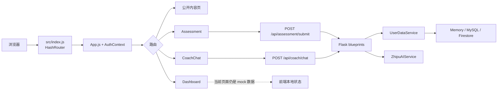

# Caifusi 项目理解

> 记录日期：2026-09-07
> 代码基线：本地 `main` 与 `origin/main` 对齐，HEAD 为 `2a4dddc`。
> 变更性质：仅文档；不修改业务逻辑，不提交密钥。

## 结论摘要

Caifusi（财赋思）是一个面向个人财务学习、状态梳理和行动复盘的 React + Flask Web 应用。产品表面上由四条能力组成：金融心智评估、AI 金融心智教练、Dashboard 和金融知识内容；README 也明确说明它不替代投资、税务或法律专业意见。

当前实现更接近“本地体验/功能验证版本”，而不是可直接承载真实账户的生产系统：前端认证仍是 `AuthContext` 中的 mock auth，开发态数据可落到进程内存；后端虽然已经有评估、Dashboard、认证、AI 和多种存储分支，但 Dashboard 页面本身仍使用 mock 数据。AI 教练依赖服务端 API Key，后端运行时依赖需要单独安装。

## 1. 阅读范围与证据边界

### 已阅读

- 公开仓库：<https://github.com/XiaoCow666/Caifusi>，以本地 `2a4dddc` 为代码快照。
- 项目定位/运行文档：`README.md`、`DEPLOYMENT_GUIDE.md`、`SECURITY_SETUP.md`、`.env.example`、`package.json`、`backend/requirements.txt`、`scripts/start-all-services.cmd`。
- 前端主链路：`src/index.js`、`src/App.js`、`src/contexts/AuthContext.js`、`src/services/api.js`、`src/pages/Assessment.js`、`src/pages/Dashboard.js`、`src/pages/CoachChat.js`。
- 后端主链路：`backend/app/__init__.py`、`backend/app/config.py`、`backend/app/routes/`、`backend/app/services/user_data_service.py`、`backend/app/services/firestore_service.py`、`backend/app/services/zhipuai_service.py`、`backend/run_dev_enhanced.py`。
- 目录清单、构建产物和现有测试入口；未把 `build/`、`docs/static/` 当作源码模块。

### AI 工具与使用方式

本次使用 OpenAI Codex（本会话中的 AI 编码助手）进行目录/文本检索、静态阅读、命令验证和文档整理；使用公开 GitHub 页面核对仓库可见性。未调用外部写入型 AI 服务，未读取或输出任何真实密钥。

### 群内资料边界

当前任务上下文没有附带可读取的群聊消息、附件或链接，因此本稿没有把不可见的群内信息当作事实。若群内另有产品决策、部署参数或账号约定，应在评审时作为补充证据回填；下文“事实”均能在仓库代码/文档或本次验证命令中复核。

## 2. 项目定位

README 将项目定位为“面向个人财务学习与复盘的 AI 辅助 Web 应用”，主要用户路径是：先通过问卷了解风险偏好、习惯和当前状态，再查阅金融知识、与 AI 教练讨论问题，并在 Dashboard 查看目标和进展。

这一定义对应的非目标也很清楚：应用用于金融教育和个人复盘，不提供投资、税务或法律专业意见。生产部署前还必须补齐真实认证、持久化、后端 API、CORS、密钥和数据库配置；GitHub Pages 只能承载静态前端，不能直接提供 AI 能力。

## 3. 目录与模块

以下是对当前目录的“职责级”归纳，不是完整文件清单：

| 目录/文件 | 职责与证据 |
| --- | --- |
| `src/index.js`、`src/App.js` | React 入口、`HashRouter`、全局 `AuthProvider`、公共/受保护路由；见 `src/index.js:1-15`、`src/App.js:102-150`。 |
| `src/contexts/AuthContext.js` | 开发态登录/注册/登出和用户资料状态；生成 `dev-user-*`，并写入 `localStorage`；见 `src/contexts/AuthContext.js:18-90`、`:100-141`。 |
| `src/pages/` | 页面层：Home、Login、Register、Assessment、Dashboard、CoachChat、NotFound，以及 `info/` 下的团队/知识/FAQ/教程/法律等内容页。 |
| `src/services/api.js` | axios 请求拦截器、通用 `fetch`、健康检查、教练、评估和 Dashboard API 封装；见 `src/services/api.js:13-48`、`:185-245`、`:247-370`。 |
| `src/firebase.js`、`src/services/firebase.js` | Firebase Web 配置入口；配置来自 `REACT_APP_*` 环境变量。 |
| `backend/app/__init__.py` | Flask app factory、CORS、蓝图注册和 `/api/health`；见 `backend/app/__init__.py:6-134`。 |
| `backend/app/routes/` | HTTP 层：`coach_routes.py`、`assessment_routes.py`、`dashboard_routes.py`、`auth_routes.py`。 |
| `backend/app/services/` | 认证、用户画像/数据、Firestore、AI 服务和配置；`user_data_service.py` 按 memory/MySQL/Firestore 分支保存与读取。 |
| `backend/app/utils/db_mysql.py`、`backend/schema.sql` | MySQL 访问辅助和表结构。 |
| `backend/run*.py` | 后端启动入口；`run_dev_enhanced.py` 在 5001 端口启动 Flask 开发服务器，并设置 `DEV_MODE=true`。 |
| `scripts/`、根目录 `*.cmd`/`*.ps1` | Windows 启动、代理、静态服务和隧道辅助脚本；脚本会并行启动前端/后端或代理。 |
| `public/`、`docs/` | 前端静态资源与已提交的 GitHub Pages 构建产物。 |
| `README.md`、`DEPLOYMENT_GUIDE.md`、`SECURITY_SETUP.md`、`docs/` | 产品说明、部署方式、密钥/安全边界和 API 配置说明。 |

仓库还包含 `scripts_old/`、`scripts_backup/`、`scripts_new/` 等历史/替代脚本，以及 `ngrok.zip`、`sunny.exe` 等工具文件；它们不是当前业务主链路，后续若整理仓库需要单独确认兼容性和保留策略。

## 4. 核心流程



### 4.1 页面进入与认证门禁

1. `src/index.js` 用 `HashRouter` 渲染 `App`。
2. `App.js` 将 `/dashboard`、`/assessment`、`/coach` 放入 `ProtectedRoute`；没有 `currentUser` 时跳转 `/login`。
3. 当前 `AuthContext` 的 `login`/`signup` 不调用后端，而是生成随机的 `dev-user-*`，将用户和资料放入浏览器 `localStorage`。这证明了“开发态可体验”，不能证明真实账户认证已经接通。

### 4.2 评估流程

1. `Assessment.js` 根据题目答案计算总分和分类百分比（`:391-425`）。
2. 用户保存结果时，调用 `submitAssessmentNew`，请求 `/api/assessment/submit`（`:427-446`；封装在 `src/services/api.js:319-328`）。
3. Flask `assessment_routes.py` 校验 `answers`、`scores`，生成建议，并交给 `UserDataService` 保存；还会尝试写入 legacy Firestore 兼容路径。
4. 历史记录通过 `/api/assessment/history` 拉取；开始教练前，前端还把一份展示用评估摘要写入 `localStorage` 的 `assessmentResults`（`Assessment.js:448-457`）。

### 4.3 AI 教练流程

1. `CoachChat.js` 读取 `assessmentResults`，把当前用户 ID、消息、聊天历史和评估上下文组装后调用 `sendMessageToCoach`（`CoachChat.js:191-216`）。
2. 前端请求 `/api/coach/chat`；后端校验消息后调用 `ZhipuAIService`。
3. `ZhipuAIService` 读取 `ZHIPUAI_API_KEY`，以最多 10 条历史消息构造提示词，调用 `glm-4-flash`，过滤 `<think>` 标签并把历史留在当前进程内存中（`backend/app/services/zhipuai_service.py:21-39`、`:41-119`）。

### 4.4 Dashboard 流程与当前边界

后端已经提供 `/api/dashboard/overview`、`/financial-health`、`/goals` CRUD、`/statistics` 和 `/recommendations`，并由 `dashboard_routes.py` 组合用户画像和数据服务。但当前 `src/pages/Dashboard.js:29-48` 明确写着“现在使用模拟数据”，直接构造 `financialHealth`、储蓄、预算和交易记录；编辑保存也只更新 React 状态，并标注“应该调用 API”（`:61-86`）。因此当前可确认的是“后端 API 和前端展示分别存在”，不能把它们描述为已经完成端到端接通。

### 4.5 数据存储与部署路径

- `backend/app/config.py` 默认 `DB_TYPE=memory`；`firestore_service.py` 在开发态使用模块级 `_dev_db`，`user_data_service.py` 另外提供 MySQL 和 Firestore 分支。
- 本地推荐前端 `npm start`（3000）+ `python backend/run_dev_enhanced.py`（5001）。
- 静态展示可发布 `docs/`；完整体验需要一个可访问的 Flask API、正确 CORS、AI Key 和持久化存储。
- 生产文档明确要求不要使用开发态默认 `SECRET_KEY`、mock auth 或内存数据。

## 5. API 与模块证据

| 前端意图 | 后端实现 | 备注 |
| --- | --- | --- |
| 健康检查 | `GET /api/health` | app factory 中直接注册。 |
| AI 教练 | `POST /api/coach/chat`、`GET /api/coach/health` | `coach_routes.py`；当前聊天路由本身没有复用评估/Dashboard 的认证装饰器。 |
| 评估 | `POST /api/assessment/submit`、`GET /api/assessment/latest`、`/history`、`/results` | 评估路由有认证装饰器，开发态可绕过。 |
| Dashboard | `/api/dashboard/overview`、`/financial-health`、`/goals`、`/statistics`、`/recommendations` | 后端路由完整度高于当前 Dashboard 页面实际接入程度。 |
| 认证 | `auth_routes.py` 中 `/verify_token`、`/me` | 前端当前 `AuthContext` 没有调用这两条接口。 |

另外，`src/services/api.js` 仍保留 `/assessments/{userId}`、`/users/{userId}` 等旧式封装，而当前后端路由主要是单数 `/assessment`、蓝图前缀 `/dashboard`；这些旧封装是否仍被外部页面使用，需要后续清理前先确认，本文不将其认定为已失效业务。

## 6. 运行与测试验证

验证环境：Windows，Node `v24.14.0`、npm `11.9.0`、Python `3.14.3`。没有读取或设置真实 API Key、Firebase 私钥、数据库密码。

| 命令 | 结果 | 解释 |
| --- | --- | --- |
| `npm run build` | 通过，exit 0 | React 生产构建完成；存在既存 ESLint 未使用变量/Hook 依赖/无效 href 警告，以及 Browserslist 数据过期提示。 |
| `npm test -- --watchAll=false --runInBand` | 未通过，exit 1 | CRA 报告 `No tests found`，28 个文件中 0 个匹配测试文件；不是业务断言失败。 |
| `python -m compileall -q backend` | 通过 | 后端 Python 文件语法编译通过。 |
| `git diff --check` | 通过 | 基线检查未发现空白错误。 |
| 下方完整的 Flask app-factory 命令 | 阻断，exit 1 | 当前 Python 环境缺少 `flask`（`ModuleNotFoundError`），因此本次没有声称已完成 Flask `test_client` 或真实 HTTP 冒烟；未擅自安装依赖。 |

实际尝试的 PowerShell 命令如下；它会导入并调用 `create_app()`，打印已注册路由，再通过 Flask `test_client` 请求 `/api/health` 和 `/api/coach/health`：

```powershell
$env:DEV_MODE='true'; python -c "from backend.app import create_app; app=create_app(); print('ROUTES'); print('\\n'.join(sorted(str(rule) for rule in app.url_map.iter_rules()))); c=app.test_client(); r=c.get('/api/health'); print('HEALTH_STATUS', r.status_code); print('HEALTH_JSON', r.get_json()); r=c.get('/api/coach/health'); print('COACH_HEALTH_STATUS', r.status_code); print('COACH_HEALTH_JSON', r.get_json())"
```

实际结果在导入阶段即为 `ModuleNotFoundError: No module named 'flask'`，所以后续路由打印和两个 `test_client` 请求没有执行。

未执行需要外部服务的验证：真实智谱 API 调用、Firebase/Firestore、MySQL、GitHub Pages 访问和隧道服务。原因是它们需要密钥、外部账号/服务或额外部署状态，不属于本次无密钥文档审查的可复现范围。

## 7. 风险、疑问与事实/推断边界

| 风险/疑问 | 代码事实 | 当前影响或需要确认的内容 |
| --- | --- | --- |
| 认证仍是开发态 | 前端登录/注册只生成 `dev-user-*` 并写 `localStorage`；后端部分装饰器在开发态直接注入测试用户。 | 不能把当前登录当作真实账户安全边界；需要确认生产是否强制 Firebase 验证，以及 `DEV_MODE` 的配置来源。 |
| `DEV_MODE` 读取口径不完全一致 | `run_dev_enhanced.py` 设置环境变量 `DEV_MODE=true`；评估路由同时看环境变量和 Flask config，但 auth/Dashboard 主要看 `current_app.config`。 | 这是静态代码发现，不等于已证明某环境必然绕过认证；应通过配置矩阵测试确认。 |
| Dashboard 数据尚未端到端接入 | 后端 Dashboard API 存在，但 `Dashboard.js` 当前构造 mock 数据，保存编辑只改本地状态。 | 用户可能看到与后端账户不一致的数据；这是最直接的产品完整性缺口。 |
| 开发态存储不持久 | 默认 `DB_TYPE=memory`，开发数据放在模块级 `_dev_db`。 | 进程重启会丢数据；生产必须明确选 MySQL 或 Firestore，并验证迁移/索引/备份。 |
| AI 对话的隐私与隔离边界 | `/api/coach/chat` 路由没有看到认证装饰器；服务把对话按 `user_id` 存在进程内字典，并记录用户 ID/消息片段日志。 | 需要确认公网部署是否另有网关鉴权、日志保留和用户 ID 校验；不能仅凭前端受保护路由推断 API 已安全。 |
| API 地址存在环境分叉 | `api.js` 同时维护 axios、通用 fetch 和教练专用 fetch；GitHub Pages 分支仍有 `https://你的API服务器地址` 占位符。 | 静态页面可以打开不等于 AI/评估/Dashboard 可用；应统一 API base URL 并做部署配置检查。 |
| 默认密钥风险 | `backend/app/config.py` 提供开发用默认 `SECRET_KEY`，文档要求生产替换。 | 这是部署配置风险，不是本次发现了真实密钥；上线检查应阻止默认值。 |
| 自动化回归信号不足 | 当前无匹配的前端测试，后端依赖也未安装到本机。 | 业务改动容易只依赖手工体验；需要最小 smoke test 和干净环境验证。 |

本文没有把 README 的“主要功能”表自动等同于“已接通功能”：凡是和源码行为存在差异的地方，以源码和命令结果为准；凡是没有真实部署配置/服务支撑的地方，均标为待确认或推断。

## 8. 1–2 天低风险改进方向

建议下一步只做“最小可执行冒烟测试门禁”，不改业务逻辑：

1. 新增 `backend/tests/test_app_smoke.py`，使用标准库 `unittest` + Flask `test_client`，在明确的 `DEV_MODE` 测试配置下覆盖 `/api/health`、关键蓝图是否注册、健康接口响应，以及非开发模式下受保护接口的 401 行为。
2. 加一条可复现命令（例如 `python -m unittest discover -s backend/tests -v`），并在 CI 或 PR 检查中运行；测试不调用智谱、Firebase、MySQL，不需要真实密钥。
3. 同时在测试说明中记录当前 Dashboard 前端仍为 mock，避免把“路由已注册”误报为“产品已端到端接入”。

验收建议：干净 Python 环境安装 `backend/requirements.txt` 后，smoke test 稳定通过；未配置 AI Key 时健康检查仍能返回可解释状态；测试失败能够区分“依赖未安装”“路由未注册”和“认证策略变化”。该方向主要增加可见性和回归保护，预计 1–2 天可完成，风险低于直接改认证、存储或业务评分逻辑。

## 9. 本 PR 范围

- 本 PR 只新增本文件。
- 不包含业务逻辑、依赖、锁文件、构建产物、密钥或部署配置改动。
- 工作区原有的 `package-lock.json` 未提交，属于本次任务开始前的用户改动。
