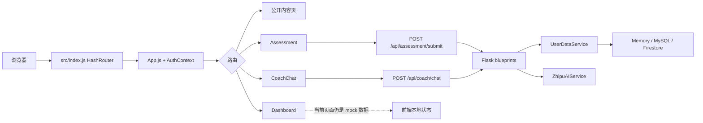

# Caifusi 项目理解

> 记录日期：2026-09-07（基线）；2026-09-13（阶段四追加）
> 代码基线：main HEAD `2a4dddc`；阶段四基于 PR #24。
> 变更性质：基线为纯文档；阶段四为测试补齐 + 一行输入校验修复，不涉及密钥/数据库/生产部署。

## 结论摘要

Caifusi（财赋思）是一个面向个人财务学习、状态梳理和行动复盘的 React + Flask Web 应用。产品表面上由四条能力组成：金融心智评估、AI 金融心智教练、Dashboard 和金融知识内容；README 也明确说明它不替代投资、税务或法律专业意见。

当前实现更接近"本地体验/功能验证版本"，而不是可直接承载真实账户的生产系统：前端认证仍是 `AuthContext` 中的 mock auth，开发态数据可落到进程内存；后端虽然已经有评估、Dashboard、认证、AI 和多种存储分支，但 Dashboard 页面本身仍使用 mock 数据。AI 教练依赖服务端 API Key，后端运行时依赖需要单独安装。

## 1. 阅读范围与证据边界

### 已阅读

- 公开仓库：<https://github.com/XiaoCow666/Caifusi>，以本地 `2a4dddc` 为代码快照。
- 项目定位/运行文档：`README.md`、`DEPLOYMENT_GUIDE.md`、`SECURITY_SETUP.md`、`.env.example`、`package.json`、`backend/requirements.txt`、`scripts/start-all-services.cmd`。
- 前端主链路：`src/index.js`、`src/App.js`、`src/contexts/AuthContext.js`、`src/services/api.js`、`src/pages/Assessment.js`、`src/pages/Dashboard.js`、`src/pages/CoachChat.js`。
- 后端主链路：`backend/app/__init__.py`、`backend/app/config.py`、`backend/app/routes/`、`backend/app/services/user_data_service.py`、`backend/app/services/firestore_service.py`、`backend/app/services/zhipuai_service.py`、`backend/run_dev_enhanced.py`。
- 目录清单、构建产物和现有测试入口；未把 `build/`、`docs/static/` 当作源码模块。

### AI 工具与使用方式

本次使用 AI 编码助手进行目录/文本检索、静态阅读、命令验证和文档整理；使用公开 GitHub 页面核对仓库可见性。未调用外部写入型 AI 服务，未读取或输出任何真实密钥。

## 2. 项目定位

README 将项目定位为"面向个人财务学习与复盘的 AI 辅助 Web 应用"，主要用户路径是：先通过问卷了解风险偏好、习惯和当前状态，再查阅金融知识、与 AI 教练讨论问题，并在 Dashboard 查看目标和进展。

这一定义对应的非目标也很清楚：应用用于金融教育和个人复盘，不提供投资、税务或法律专业意见。生产部署前还必须补齐真实认证、持久化、后端 API、CORS、密钥和数据库配置；GitHub Pages 只能承载静态前端，不能直接提供 AI 能力。

## 3. 目录与模块

以下是对当前目录的"职责级"归纳，不是完整文件清单：

| 目录/文件 | 职责与证据 |
| --- | --- |
| `src/index.js`、`src/App.js` | React 入口、`HashRouter`、全局 `AuthProvider`、公共/受保护路由。 |
| `src/contexts/AuthContext.js` | 开发态登录/注册/登出和用户资料状态；生成 `dev-user-*`，并写入 `localStorage`。 |
| `src/pages/` | 页面层：Home、Login、Register、Assessment、Dashboard、CoachChat、NotFound，以及 `info/` 下的内容页。 |
| `src/services/api.js` | axios 请求拦截器、健康检查、教练、评估和 Dashboard API 封装。 |
| `src/firebase.js` | Firebase Web 配置入口；配置来自 `REACT_APP_*` 环境变量。 |
| `backend/app/__init__.py` | Flask app factory、CORS、蓝图注册和 `/api/health`。 |
| `backend/app/routes/` | HTTP 层：`coach_routes.py`、`assessment_routes.py`、`dashboard_routes.py`、`auth_routes.py`。 |
| `backend/app/services/` | 认证、用户画像/数据、Firestore、AI 服务和配置。 |
| `backend/app/utils/db_mysql.py`、`backend/schema.sql` | MySQL 访问辅助和表结构。 |
| `backend/run*.py` | 后端启动入口；`run_dev_enhanced.py` 在 5001 端口启动 Flask 开发服务器。 |
| `scripts/`、根目录 `*.cmd`/`*.ps1` | Windows 启动、代理、静态服务和隧道辅助脚本。 |
| `public/`、`docs/` | 前端静态资源与已提交的 GitHub Pages 构建产物。 |

## 4. 核心流程



### 4.1 页面进入与认证门禁

1. `src/index.js` 用 `HashRouter` 渲染 `App`。
2. `App.js` 将 `/dashboard`、`/assessment`、`/coach` 放入 `ProtectedRoute`；没有 `currentUser` 时跳转 `/login`。
3. 当前 `AuthContext.js` 的 `login`/`signup` 不调用后端，而是生成随机的 `dev-user-*`，将用户和资料放入浏览器 `localStorage`。

### 4.2 评估流程

1. `Assessment.js` 根据题目答案计算总分和分类百分比。
2. 用户保存结果时请求 `/api/assessment/submit`。
3. Flask `assessment_routes.py` 校验 `answers`、`scores`，生成建议，并交给 `UserDataService` 保存。
4. 历史记录通过 `/api/assessment/history` 拉取。

### 4.3 AI 教练流程

1. `CoachChat.js` 读取评估摘要，把用户 ID、消息和历史组装后调用 `sendMessageToCoach`。
2. 前端请求 `/api/coach/chat`；后端校验消息后调用 `ZhipuAIService`。
3. `ZhipuAIService` 读取 `ZHIPUAI_API_KEY`，调用 `glm-4-flash`。

### 4.4 Dashboard 流程与当前边界

后端已提供 `/api/dashboard/overview`、`/financial-health`、`/goals` CRUD、`/statistics` 和 `/recommendations`。但当前 `Dashboard.js` 仍使用 mock 数据，编辑保存只更新 React 状态。

### 4.5 数据存储与部署路径

- `config.py` 默认 `DB_TYPE=memory`；firestore_service.py 在开发态使用模块级 `_dev_db`。
- 本地推荐前端 `npm start`（3000）+ `python backend/run_dev_enhanced.py`（5001）。
- 生产文档明确要求不要使用开发态默认 `SECRET_KEY`、mock auth 或内存数据。

## 5. API 与模块证据

| 前端意图 | 后端实现 | 备注 |
| --- | --- | --- |
| 健康检查 | `GET /api/health` | `app/__init__.py` 中直接注册。 |
| AI 教练 | `POST /api/coach/chat`、`GET /api/coach/health` | `coach_routes.py`；聊天路由没有认证装饰器。 |
| 评估 | `POST /api/assessment/submit`、`GET /api/assessment/latest`、`/history` | `assessment_routes.py` 有认证装饰器。 |
| Dashboard | `/api/dashboard/overview`、`/financial-health`、`/goals`、`/statistics`、`/recommendations` | `dashboard_routes.py`；后端路由完整度高于前端接入程度。 |
| 认证 | `auth_routes.py` 中 `/verify_token`、`/me` | 前端当前 `AuthContext` 没有调用这两条接口。 |

## 6. 运行与测试验证（基线）

验证环境：Windows，Node `v24.14.0`、npm `11.9.0`、Python `3.14.3`。没有读取或设置真实 API Key、Firebase 私钥、数据库密码。

| 命令 | 结果 | 解释 |
| --- | --- | --- |
| `npm run build` | 通过，exit 0 | React 生产构建完成。 |
| `npm test -- --watchAll=false --runInBand` | 未通过，exit 1 | CRA 报告 `No tests found`。 |
| `python -m compileall -q backend` | 通过 | 后端 Python 文件语法编译通过。 |

## 7. 风险、疑问与事实/推断边界

| 风险/疑问 | 代码事实 | 当前影响或需要确认的内容 |
| --- | --- | --- |
| 认证仍是开发态 | AuthContext 前端登录生成 `dev-user-*`；后端部分装饰器开发态注入测试用户。 | 不能把当前登录当作真实账户安全边界。 |
| Dashboard 数据尚未端到端接入 | 后端 API 存在，但 Dashboard.js 当前构造 mock 数据。 | 用户可能看到与后端账户不一致的数据。 |
| 开发态存储不持久 | 默认 `DB_TYPE=memory`。 | 进程重启会丢数据；生产必须明确选 MySQL 或 Firestore。 |
| AI 对话无认证装饰器 | coach/chat 没有认证；对话按 user_id 存在进程内字典。 | 需要确认公网部署是否另有网关鉴权。 |
| 自动化回归信号不足 | 基线时无匹配的前端测试。 | 业务改动容易只依赖手工体验。 |

## 8. 低风险改进方向（基线建议）

基线建议新增 smoke test 门禁，不改业务逻辑：覆盖 `/api/health`、关键蓝图注册、健康接口响应和非开发模式 401 行为。

---

## 9. 阶段四：Dashboard 空请求体修复与验证

### 9.1 任务台字段

| 字段 | 内容 |
| --- | --- |
| **project_area** | Dashboard 后端目标创建路由（`POST /api/dashboard/goals`） |
| **problem_goal** | 空请求体或非法 JSON 时，`request.get_json()` 抛 BadRequest 被外层 `except Exception` 兜成 500；目标是让客户端输入错误返回语义正确的 400 |
| **reproduction_evidence** | 见 9.2 复现表 |
| **planned_changes** | 将 `create_goal` 中 `request.get_json()` 改为 `get_json(silent=True)`；新增 18 个 dashboard 路由回归测试；新增 `requirements-dev.txt` 声明 pytest |
| **learning_summary** | 见 9.5 |
| **verification_result** | 见 9.4 |

### 9.2 输入校验修复事实

**`backend/app/routes/dashboard_routes.py::create_goal`**：

- 修复前：`goal_data = request.get_json()`。当 Content-Type 为 `application/json` 但 body 为空或非法 JSON（如 `{`），Flask 的 `get_json()` 会抛 `werkzeug.exceptions.BadRequest`。该异常发生在 `try` 块内，被 `except Exception as e` 捕获，返回 `{"status": "error", "message": f"创建目标失败: {str(e)}"}` 状态码 500。
- 修复后：`goal_data = request.get_json(silent=True)`。`silent=True` 时解析失败返回 `None` 而非抛异常，随后进入 `if not goal_data:` 分支，返回 400 "目标数据不能为空"。
- 这与项目此前 coach /chat（PR #12）和 assessment /submit 输入校验修复保持同一模式。

**复现请求与状态码对比**：

| 端点 | Content-Type | body | 修复前 | 修复后 | 测试名 | 验证方式 |
| --- | --- | --- | --- | --- | --- | --- |
| POST /api/dashboard/goals | application/json | （空） | 500 | 400 | `test_empty_body_returns_400` | 实测 |
| POST /api/dashboard/goals | application/json | `{` | 500 | 400 | `test_invalid_json_returns_400` | 实测 |
| POST /api/coach/chat | application/json | `[]`（顶层数组） | 500 | 400 | `test_top_level_array_returns_400` | 实测（基线已有） |
| POST /api/coach/chat | application/json | `{"message": ""}` | 500 | 400 | `test_message_empty_string_returns_400` | 实测（基线已有） |
| POST /api/assessment/submit | application/json | scores 为数组 | 500 | 400 | `test_scores_not_object_returns_400` | 实测（基线已有） |

### 9.3 改动文件清单

| 文件 | 变更 | 说明 |
| --- | --- | --- |
| `backend/tests/test_dashboard_routes.py` | 新增 | 18 个单元测试：认证 3、overview 2、financial-health 2、goals 查询 3、goals 创建 4、statistics 2、recommendations 2 |
| `backend/requirements-dev.txt` | 新增 | 声明 `pytest>=7.0.0` |
| `backend/app/routes/dashboard_routes.py` | 一行修改 | `get_json()` → `get_json(silent=True)` + 注释 |
| `docs/PROJECT_UNDERSTANDING.md` | 追加 | 本阶段四章节 |

### 9.4 验证结果

**验证环境**：Windows，Python 3.13.13，pytest 9.1.1，Flask 3.1.3，`DB_TYPE=memory`，`DEV_MODE=true`。

**命令与结果**：

```
$ cd backend
$ $env:DB_TYPE="memory"; $env:DEV_MODE="true"; python -m pytest tests/test_dashboard_routes.py -v
============================= 18 passed in 0.40s ==============================

$ python -m pytest tests/
collected 50 items
tests\test_app_smoke.py ....                                             [  8%]
tests\test_assessment_routes.py .............                            [ 34%]
tests\test_coach_routes.py ...............                               [ 64%]
tests\test_dashboard_routes.py ..................                        [100%]
============================= 50 passed in 2.29s ==============================
```

退出码：0。

**提交关系**：
- `9ddc736`：初始 PR 提交（3 文件，49 测试通过）
- `5dc1441` / `b0c1a68`：合并上游 main 后解决文档冲突的提交
- 当前 head 为冲突解决后的最新提交；本次 18 个 dashboard 测试 + 50 个全量测试在该代码上实际运行通过

### 9.5 学习总结

**为什么解析异常会被兜成 500**：Flask 的 `request.get_json()` 在 Content-Type 声明为 JSON 但 body 解析失败时，默认行为是抛出 `BadRequest` 异常。`create_goal` 的函数体整体包在 `try...except Exception` 中，这个 `except` 的设计意图是捕获业务逻辑异常（如数据库错误），但它同时捕获了 `BadRequest`，把"客户端发了坏 JSON"和"服务器内部出错"混为一谈，统一返回 500。修复方式是让 `get_json(silent=True)` 在解析失败时返回 `None`，这样就不需要依赖异常来做流程控制，空值检查 `if not goal_data` 自然返回 400。

**Mock 测试能证明什么**：
- 能证明：在给定的请求和 mock 依赖下，路由返回了正确的状态码和 JSON 结构；服务层是否被调用。
- 不能证明：真实数据库写入是否成功；真实 Firebase 认证是否工作；AI 服务是否正常；前端是否正确调用了这些 API；并发或真实网络环境下的行为。

### 9.6 未覆盖范围

- PUT `/goals/<goal_id>` 和 DELETE `/goals/<goal_id>` 未新增测试（同样有 `get_json()` 模式，保持小范围未纳入）。
- `auth_routes.py` 未新增测试。
- 前端 React 组件测试仍为 0。
- 未在 CI 环境运行，仅本地 Windows + Python 3.13 验证。
- 未触达真实 AI 服务、Firebase、MySQL。

---

## 10. 阶段六：跨平台启动故障收口

### 10.1 任务台字段

| 字段 | 内容 |
| --- | --- |
| **project_area** | `package.json::scripts.start` 与新增 `.env.development` |
| **problem_goal** | 原 start 脚本使用 Windows CMD `set VAR=value&&...` 语法，macOS/Linux 下 bash 的 `set` 是内置命令但语义是设置 shell 选项，不会按 CMD 方式设置环境变量。导致非 Windows 用户运行 `npm start` 时，`HOST` / `DANGEROUSLY_DISABLE_HOST_CHECK` / `WDS_SOCKET_HOST` 均未生效——开发服务器绑定 localhost，访问局域网 IP 收到 "Invalid Host header"。预期：所有平台 `npm start` 一致启动开发服务器。 |
| **reproduction_evidence** | 见 10.2 |
| **planned_changes** | 见 10.3 |
| **learning_summary** | 见 10.5 |
| **verification_result** | 见 10.4 |

### 10.2 复现证据

| 项目 | 内容 |
| --- | --- |
| 操作系统 | macOS / Linux（POSIX shell） |
| Shell | bash |
| 原命令 | `npm start`（实际执行 `set WDS_SOCKET_HOST=localhost&&set HOST=0.0.0.0&&set DANGEROUSLY_DISABLE_HOST_CHECK=true&&react-scripts start`） |
| 实际现象 | bash 中 `set` 不设置环境变量；`&&` 后 react-scripts 启动，但三个变量均未传入进程环境。开发服务器绑定 localhost，局域网访问被 Host 检查拦截。 |
| 修复后 | `.env.development` 由 react-scripts（dotenv）在所有平台统一加载；start 脚本为纯 `react-scripts start`。 |

### 10.3 改动文件清单

| 文件 | 变更 | 说明 |
| --- | --- | --- |
| `.env.development` | 新增 | `HOST=0.0.0.0`、`DANGEROUSLY_DISABLE_HOST_CHECK=true`、`WDS_SOCKET_HOST=localhost` |
| `package.json` | 修改 1 行 | `"start": "set ...&&react-scripts start"` → `"start": "react-scripts start"` |
| `src/utils/cross-platform-compat.test.js` | 新增 | 5 个静态文本测试：start 脚本不含 CMD set 语法、.env.development 存在且包含三个变量 |

### 10.4 验证结果

**前端测试**：
- 环境：Windows，Node v24，npm 11
- 命令：`set CI=true&&npm test -- --watchAll=false`
- 结果：4 test suites passed，**58 tests passed**，0 failed
- 新增测试文件：`src/utils/cross-platform-compat.test.js`（5 项）

**后端测试**：
- 环境：Windows，Python 3.13
- 命令：`python -m pytest tests/ -v`（backend 目录）
- 结果：50 passed（阶段四结果，本次未重跑后端）

**未验证**：
- macOS/Linux 下 `npm start` 实际启动和 HMR 行为——无该环境
- 局域网设备访问开发服务器——未实际测试
- `.env.development` 中 HOST=0.0.0.0 是否在 CRA 中实际生效——静态测试不启动服务器
- WDS_SOCKET_HOST=localhost 对局域网访问 HMR 的影响——未验证

### 10.5 学习总结

**CMD 与 POSIX shell 的变量设置区别**：
- Windows CMD：`set VAR=value` 是内置命令，设置当前 shell 进程的环境变量，后续 `&&` 连接的子进程继承。
- POSIX shell（bash/zsh）：`set` 也是内置命令，但语义是设置 shell 选项（如 `set -e` 开启错误退出）。`set VAR=value` 会被解析为位置参数赋值，不设置环境变量。POSIX 中正确写法是 `VAR=value command`（临时变量）或 `export VAR=value && command`（导出变量）。
- 这就是为什么原脚本在 bash 中不报错但环境变量无效——`set VAR=value` 静默成功，只是什么都没做。

**dotenv 加载机制**：
- react-scripts（CRA）启动时自动用 dotenv 加载 `.env`、`.env.development`、`.env.local` 等文件。
- 文件中的 `KEY=value` 被写入 `process.env`，与 shell 无关。
- 因此把环境变量从 npm scripts 移到 `.env.development` 后，Windows 和 macOS/Linux 都能正确加载。
- 注意：只有 `REACT_APP_` 前缀的变量会暴露给浏览器端代码；非前缀变量（如 HOST）仅在 Node 进程内可见，这正好满足 webpack-dev-server 的需求。

**静态测试的局限**：本测试只检查文件内容，不启动服务器。它能保证 start 脚本不含 CMD 语法且 .env.development 存在，但不能证明服务器实际监听 0.0.0.0 或 HMR WebSocket 正常工作。这些需在目标 OS 手动 `npm start` 验证。

**保留旧配置的说明**：HOST=0.0.0.0 和 DANGEROUSLY_DISABLE_HOST_CHECK=true 沿用了原脚本的值，未做安全调整。默认绑定 0.0.0.0 意味着局域网内任何人都能访问开发服务器，这在共享网络中有风险。建议后续评估是否改为绑定 localhost 并文档化局域网访问的替代方案。

